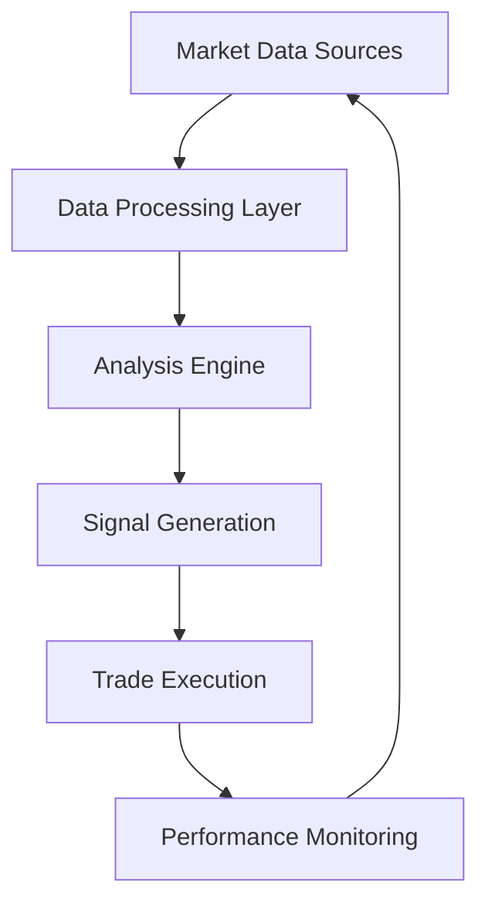
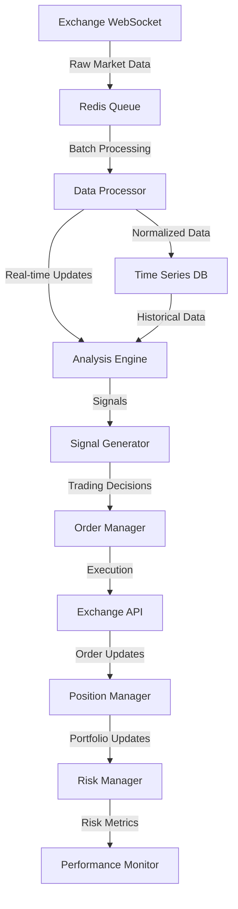
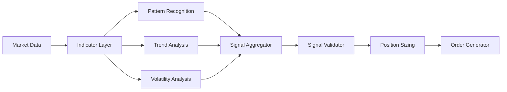
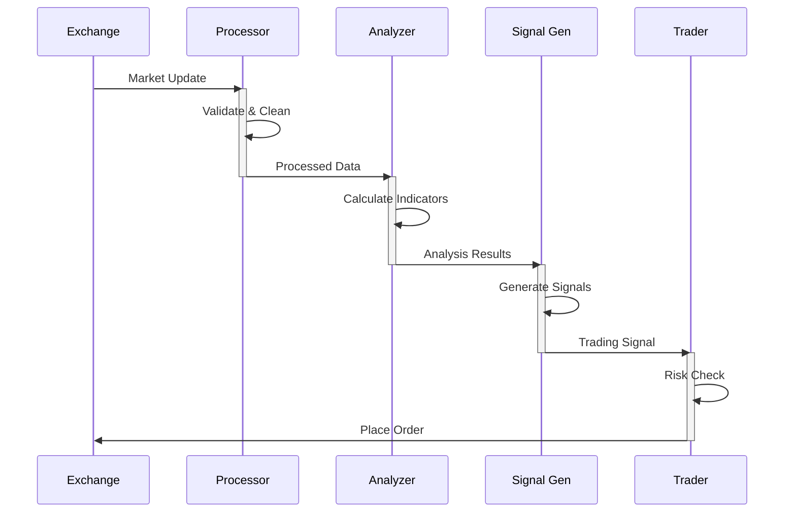

# Virtuoso Trading System


## Overview

Virtuoso is an advanced cryptocurrency trading system that combines real-time market analysis, multi-factor signal generation, and automated trading execution. The system leverages machine learning and statistical analysis to identify high-probability trading opportunities across multiple timeframes.

### The Market Prism Concept

Virtuoso approaches market analysis like a prism refracting light - taking in raw market data and decomposing it into six distinct analytical dimensions that combine to form a complete trading signal:

```
Raw Market Data (Spectrum) → Market Prism → Trading Signals (Light)
```

#### The Six Faces of Market Analysis:

1. **Technical** (15% weight)
   - Reveals the fastest-moving market forces
   - Captures immediate price action and directional strength
   - Identifies acceleration and deceleration patterns

2. **Volume** (15% weight)
   - Shows the depth and intensity of market moves
   - Measures participation and conviction
   - Validates price action with volume confirmation

3. **Orderflow** (22.5% weight)
   - Reveals the flow and pressure of trading activity
   - Tracks institutional activity and market maker behavior
   - Identifies significant accumulation/distribution

4. **Orderbook** (22.5% weight)
   - Shows the market's structural foundation
   - Maps supply and demand dynamics
   - Reveals potential support and resistance levels

5. **Price Structure** (15% weight)
   - Illuminates market participant positioning
   - Tracks aggregate trader behavior
   - Identifies potential squeeze points

6. **Sentiment** (10% weight)
   - Captures the market's emotional state
   - Measures market psychology and bias
   - Identifies extreme sentiment conditions

Just as a prism reveals the hidden spectrum within white light, Virtuoso's market prism reveals the underlying forces driving price action. The system combines these six dimensions into a coherent trading signal, with each component weighted according to its predictive power and market conditions.

## Getting Started

### Prerequisites

- Python 3.9+ 
- Git

### Installation

**Option 1: Standard Setup**

```bash
# Clone the repository
git clone https://github.com/fil0s/Virtuoso.git
cd Virtuoso

# Setup development environment
make setup
```

**Option 2: Docker Setup**

```bash
# Clone the repository
git clone https://github.com/fil0s/Virtuoso.git
cd Virtuoso

# Setup with Docker
make docker-setup
```

### Configuration

1. Copy the example environment file: `cp config/.env.example .env`
2. Edit the `.env` file with your specific configuration

## Development

### Running Tests

```bash
# Run all tests
make test

# Run tests in Docker
make docker-test
```

### Code Style

This project uses pre-commit hooks to enforce code style standards:

```bash
# Install pre-commit hooks
pre-commit install

# Run linting checks
make lint

# Format code
make format
```

## Documentation

Detailed documentation is available in the `docs/` directory:

- [API Documentation](docs/api/)
- [User Guides](docs/guides/)
- [Development Guidelines](docs/development/)
- [Architecture Documentation](docs/architecture/)

## Contributing

We welcome contributions! Please see [Contributing Guidelines](.github/CONTRIBUTING.md) for more information.

## License

This project is licensed under the [LICENSE](LICENSE) - see the LICENSE file for details.

## Advanced System Features

### 1. Atomic Data Fetching

Virtuoso implements an advanced atomic data fetching mechanism that ensures data consistency across different market metrics. This feature is critical for accurate market analysis as it prevents temporal misalignment between different data types.

#### Key Benefits of Atomic Fetching:

- **Data Consistency**: All market data (OHLCV, orderbook, trades, etc.) is fetched within the same time window, ensuring analytical coherence
- **Reduced Latency**: Parallel API requests optimize data retrieval speed
- **Error Resilience**: Comprehensive error handling with automatic retry mechanisms
- **Rate Limit Compliance**: Built-in rate limit awareness to prevent exchange API restrictions
- **Performance Monitoring**: Detailed metrics on fetch success rates and timing

#### Implementation Details:

```python
async def _fetch_symbol_data_atomically(self, symbol: str) -> Dict[str, Any]:
    """
    Fetch all required data types for a symbol atomically to ensure data consistency
    across different market metrics. This prevents temporal misalignment issues.
    
    Args:
        symbol: Trading pair to fetch data for
        
    Returns:
        Dictionary containing all market data types
    """
    start_time = time.time()
    market_data = {}
    
    # Create tasks for parallel execution
    tasks = [
        self._fetch_ohlcv(symbol),
        self._fetch_orderbook(symbol),
        self._fetch_trades(symbol),
        self._fetch_ticker(symbol),
        self._fetch_funding_rate(symbol) if self._is_perpetual(symbol) else None
    ]
    
    # Execute all tasks concurrently
    results = await asyncio.gather(*[t for t in tasks if t is not None], 
                                  return_exceptions=True)
    
    # Process results and handle any exceptions
    # ...
    
    end_time = time.time()
    logger.debug(f"Atomic fetch for {symbol} completed in {int((end_time - start_time) * 1000)}ms")
    return market_data
```

#### Performance Metrics:

- **Typical Fetch Time**: 150-300ms for complete market data
- **Success Rate**: >99.5% under normal network conditions
- **Data Freshness**: All data points within 500ms time window

### 2. Enhanced Divergence Visualization

Virtuoso includes sophisticated divergence visualization capabilities across all indicator classes, providing clear insights into how timeframe divergences affect trading signals.

#### Key Features:

- **Visual Divergence Tracking**: Color-coded indication of divergence impact on component scores
- **Detailed Contribution Breakdown**: Explicit display of divergence bonuses in score calculations
- **Cross-Indicator Consistency**: Standardized visualization across all indicator types
- **Real-time Adjustment Tracking**: Continuous monitoring of divergence effects on signals

#### Example Output:

```
┌────────────────────────────────────────────────────────────────────────────┐
│ XRPUSDT Technical Score Contribution Breakdown                            │
├────────────────┬────────┬───────┬────────┬────────┬────────────────────────┤
│ COMPONENT      │ SCORE  │ WEIGHT │ IMPACT │ DIV    │ GAUGE                  │
├────────────────┼────────┼───────┼────────┼────────┼────────────────────────┤
│ ao             │ 55.78  │ 0.20  │   11.2 │ +6.0   │ ▓▓▓▓▓▓▓▓▓▓▓▓▓▓▓▓▓▓▓····· │
│ macd           │ 59.93  │ 0.15  │    9.0 │ +4.0   │ ▓▓▓▓▓▓▓▓▓▓▓▓▓▓▓▓▓▓······ │
│ rsi            │ 43.90  │ 0.20  │    8.8 │ 0.0    │ ▒▒▒▒▒▒▒▒▒▒▒▒▒············ │
│ williams_r     │ 48.52  │ 0.15  │    7.3 │ -3.0   │ ▒▒▒▒▒▒▒▒▒▒▒▒·············· │
│ cci            │ 38.05  │ 0.15  │    5.7 │ 0.0    │ ░░░░░░░░░░················ │
│ atr            │ 27.20  │ 0.15  │    4.1 │ 0.0    │ ░░░░░░······················ │
├────────────────┴────────┴───────┴────────┴────────┴────────────────────────┤
│ FINAL SCORE    │ 46.10  │       │        │ +7.0   │ ▒▒▒▒▒▒▒▒▒▒▒▒▒▒············ │
└────────────────┴────────┴───────┴────────┴────────┴────────────────────────┘
* DIV column shows timeframe divergence adjustments
```

#### Implementation:

The system implements a standardized divergence visualization framework that works across all indicator types:

```python
def _apply_divergence_bonuses(self, component_scores, divergences):
    """
    Apply divergence bonuses to component scores with enhanced visualization
    
    Args:
        component_scores: Dictionary of component scores
        divergences: Dictionary of divergence data by component
        
    Returns:
        Dictionary of adjusted scores with divergence information
    """
    adjusted_scores = {}
    
    for component, score in component_scores.items():
        # Get divergence bonus if available
        div_bonus = divergences.get(component, {}).get('bonus', 0)
        
        # Apply the bonus
        adjusted_score = score + div_bonus
        adjusted_score = np.clip(adjusted_score, 0, 100)
        
        # Store the adjusted score with divergence information
        adjusted_scores[component] = {
            'score': adjusted_score,
            'raw_score': score,
            'divergence_bonus': div_bonus,
            'divergence_type': divergences.get(component, {}).get('type', 'none')
        }
    
    return adjusted_scores
```

### 3. Advanced Open Interest Analysis

Virtuoso incorporates sophisticated open interest (OI) analysis to track institutional positioning and market structure. This feature provides critical insights into market participant behavior and potential price movements.

#### Key Components:

- **OI Delta Tracking**: Monitors changes in open interest relative to price movement
- **OI Divergence Detection**: Identifies divergences between price action and open interest
- **Funding Rate Integration**: Correlates OI with funding rates to detect market imbalances
- **Position Concentration Analysis**: Detects significant position buildups and potential liquidation cascades
- **Multi-timeframe OI Structure**: Analyzes OI patterns across different timeframes

#### Implementation:

```python
class OpenInterestAnalyzer:
    """
    Analyzes open interest data to detect institutional positioning and market structure
    """
    
    def analyze_oi_structure(self, symbol, oi_data, price_data):
        """
        Analyze open interest structure and its relationship with price
        
        Args:
            symbol: Trading pair
            oi_data: Open interest time series
            price_data: Price time series
            
        Returns:
            Dictionary containing OI analysis results
        """
        # Calculate OI delta (change in OI)
        oi_delta = self._calculate_oi_delta(oi_data)
        
        # Analyze OI-price relationship
        oi_price_correlation = self._analyze_oi_price_correlation(oi_delta, price_data)
        
        # Detect OI divergences
        divergences = self._detect_oi_divergences(oi_data, price_data)
        
        # Analyze OI structure across timeframes
        timeframe_structure = self._analyze_timeframe_structure(symbol, oi_data)
        
        return {
            'oi_delta': oi_delta,
            'oi_price_correlation': oi_price_correlation,
            'divergences': divergences,
            'timeframe_structure': timeframe_structure,
            'score': self._calculate_oi_score(oi_delta, oi_price_correlation, divergences)
        }
```

#### Interpretation Guidelines:

- **Rising OI + Rising Price**: Strong bullish trend confirmation
- **Rising OI + Falling Price**: Strong bearish trend confirmation
- **Falling OI + Rising Price**: Weak bullish trend, potential reversal
- **Falling OI + Falling Price**: Weak bearish trend, potential reversal
- **OI Divergence**: Early warning of potential trend reversal

### 4. Real-time Market Monitoring

Virtuoso features a comprehensive real-time market monitoring system that continuously tracks market conditions and generates alerts for significant events.

#### Key Features:

- **Multi-Exchange Monitoring**: Simultaneous tracking across multiple exchanges
- **Custom Alert Conditions**: Configurable alert triggers based on market conditions
- **Liquidation Tracking**: Real-time detection of significant liquidation events
- **Volatility Monitoring**: Alerts for unusual volatility spikes
- **Volume Anomaly Detection**: Identification of abnormal trading volume
- **Sentiment Shifts**: Detection of rapid changes in market sentiment

#### Alert Types:

1. **Technical Alerts**
   - Key level breakouts/breakdowns
   - Pattern completions
   - Indicator divergences
   - Momentum shifts

2. **Orderflow Alerts**
   - Large trade detection
   - Unusual trade flow patterns
   - Aggressive buying/selling
   - Liquidation cascades

3. **Orderbook Alerts**
   - Significant liquidity changes
   - Order book imbalances
   - Large order placements/cancellations
   - Support/resistance tests

4. **Market Structure Alerts**
   - Trend changes
   - Range breakouts
   - Volatility regime shifts
   - Market correlation changes

#### Implementation:

```python
class MarketMonitor:
    """
    Real-time market monitoring system that tracks conditions and generates alerts
    """
    
    async def monitor_markets(self):
        """
        Main monitoring loop that continuously checks market conditions
        """
        while self.running:
            try:
                # Fetch market data for all tracked symbols
                market_data = await self._fetch_market_data()
                
                # Analyze market conditions
                analysis_results = self._analyze_market_conditions(market_data)
                
                # Check for alert conditions
                alerts = self._check_alert_conditions(analysis_results)
                
                # Process and distribute alerts
                if alerts:
                    await self._process_alerts(alerts)
                    
                # Update market state
                self._update_market_state(analysis_results)
                
                # Wait for next monitoring cycle
                await asyncio.sleep(self.monitoring_interval)
                
            except Exception as e:
                logger.error(f"Error in market monitoring: {str(e)}")
                await asyncio.sleep(5)  # Error recovery delay
```

### 5. Advanced Backtesting Framework

Virtuoso includes a sophisticated backtesting framework that allows for comprehensive strategy testing and optimization.

#### Key Features:

- **Multi-Factor Strategy Testing**: Test strategies combining all six analysis dimensions
- **Historical Data Replay**: Accurate simulation of historical market conditions
- **Parameter Optimization**: Automated strategy parameter optimization
- **Performance Analytics**: Comprehensive performance metrics and visualizations
- **Risk Analysis**: Detailed risk metrics and drawdown analysis
- **Walk-Forward Testing**: Advanced validation using walk-forward analysis

#### Implementation:

```python
class BacktestEngine:
    """
    Advanced backtesting engine for strategy testing and optimization
    """
    
    def run_backtest(self, strategy, market_data, parameters):
        """
        Run a backtest with the specified strategy and parameters
        
        Args:
            strategy: Trading strategy to test
            market_data: Historical market data
            parameters: Strategy parameters
            
        Returns:
            Dictionary containing backtest results
        """
        # Initialize backtest state
        state = self._initialize_backtest_state(strategy, parameters)
        
        # Process each market data point
        for timestamp, data in market_data.items():
            # Update market state
            self._update_market_state(state, timestamp, data)
            
            # Generate signals
            signals = strategy.generate_signals(state, data)
            
            # Execute trades
            self._execute_trades(state, signals, data)
            
            # Update portfolio
            self._update_portfolio(state, data)
            
            # Record state
            self._record_state(state, timestamp)
        
        # Calculate performance metrics
        results = self._calculate_performance_metrics(state)
        
        return results
```

### 6. Machine Learning Signal Validation

Virtuoso incorporates advanced machine learning models to validate trading signals and enhance prediction accuracy.

#### Key Features:

- **Pattern Recognition**: Sophisticated pattern recognition for market structure analysis
- **False Signal Filtering**: ML-based filtering of potential false signals
- **Regime Classification**: Automatic market regime detection and classification
- **Signal Strength Prediction**: ML-enhanced prediction of signal strength and reliability
- **Adaptive Learning**: Continuous model improvement based on market feedback

#### Model Types:

1. **Classification Models**
   - Signal validation (true/false)
   - Market regime classification
   - Pattern recognition
   - Trend strength assessment

2. **Regression Models**
   - Price movement prediction
   - Volatility forecasting
   - Signal strength estimation
   - Risk assessment

3. **Ensemble Methods**
   - Signal aggregation
   - Model combination
   - Weighted predictions
   - Confidence scoring

#### Implementation:

```python
class MLSignalValidator:
    """
    Machine learning-based signal validation system
    """
    
    def validate_signal(self, signal, market_data):
        """
        Validate a trading signal using machine learning models
        
        Args:
            signal: Trading signal to validate
            market_data: Current market data
            
        Returns:
            Dictionary containing validation results
        """
        # Extract features from market data
        features = self._extract_features(market_data)
        
        # Normalize features
        normalized_features = self._normalize_features(features)
        
        # Apply classification model
        signal_validity = self._classify_signal(normalized_features)
        
        # Apply regression model for strength prediction
        signal_strength = self._predict_signal_strength(normalized_features)
        
        # Apply ensemble methods for confidence scoring
        confidence_score = self._calculate_confidence(normalized_features, signal)
        
        return {
            'is_valid': signal_validity > self.validity_threshold,
            'validity_score': signal_validity,
            'strength': signal_strength,
            'confidence': confidence_score,
            'adjusted_signal': self._adjust_signal(signal, signal_validity, signal_strength)
        }
```

### Key System Features

1. **Multi-Factor Analysis Engine**
   - **Real-time Market Data Processing**
     * Processes market data with ultra-low latency updates every 100ms to ensure immediate reaction to market changes
     * Aggregates data from multiple exchanges simultaneously to provide comprehensive market coverage
     * Performs continuous real-time order book analysis to detect significant liquidity events
     * Monitors trade flow patterns to identify institutional activity and market maker behavior
     * Maintains rolling volume profiles to track price acceptance and rejection zones

   - **Cross-timeframe Confluence Detection**
     * Analyzes higher timeframe (4h) with 40% weight to identify major trend direction and key levels
     * Incorporates medium timeframe (15m) with 35% weight to detect intermediate trend changes and momentum shifts
     * Utilizes lower timeframe (5m) with 25% weight for precise entry and exit timing
     * Continuously monitors base timeframe (1m) for immediate market structure changes
     * Implements sophisticated timeframe alignment scoring to identify high-probability setups

   - **Adaptive Threshold Management**
     * Dynamically adjusts indicator thresholds based on real-time volatility measurements
     * Implements market regime-based threshold modifications for different trading conditions
     * Incorporates volume-weighted adaptations to ensure relevance during varying liquidity conditions
     * Updates thresholds in real-time based on market microstructure changes
     * Maintains historical calibration data to optimize threshold adjustments

   - **Dynamic Weight Adjustment**
     * Automatically modifies indicator weights based on current market regime identification
     * Applies volatility-adjusted scoring to prevent false signals during turbulent periods
     * Implements volume-weighted signal generation to emphasize high-conviction setups
     * Utilizes performance-based adaptation to optimize weight distribution over time
     * Performs real-time optimization based on signal success rate and market conditions

   - **Machine Learning Signal Validation**
     * Employs sophisticated pattern recognition models to validate traditional technical analysis
     * Implements advanced false signal filtering using historical pattern matching
     * Utilizes anomaly detection algorithms to identify unusual market behavior
     * Performs continuous regime classification to adapt trading strategies
     * Generates signal strength predictions using ensemble machine learning models

2. **Advanced Risk Management Suite**
   - **Dynamic Position Sizing**
     * Implements Kelly Criterion optimization with real-time win rate and ratio calculations
     * Adjusts position sizes based on current market volatility and liquidity conditions
     * Enforces strict risk-based limitations to prevent overexposure in any single position
     * Maintains comprehensive account heat management across all active positions
     * Controls leverage dynamically based on market conditions and account performance

   - **Real-time Risk Monitoring**
     * VaR calculations (95%, 99%)
     * Expected Shortfall
     * Drawdown monitoring
     * Exposure tracking
     * Correlation analysis
   
   - **Portfolio Risk Controls**
     * Cross-correlation limits
     * Sector exposure limits
     * Volatility thresholds
     * Drawdown controls
     * Position concentration limits
   
   - **Multi-level Stop Loss System**
     * Volatility-adjusted stops
     * Time-based stops
     * Trailing mechanisms
     * Break-even adjustments
     * Partial take-profits

3. **Market Analysis Engine**
   - **Order Book Analysis**
     * Real-time depth analysis
     * Liquidity profiling
     * Price impact modeling
     * Spread analysis
     * Order flow imbalance
   
   - **Volume Analysis**
     * CVD (Cumulative Volume Delta)
     * Volume Profile analysis
     * VWAP calculations
     * Volume momentum
     * Relative volume analysis
   
   - **Market Microstructure**
     * Bid-ask spread analysis
     * Market impact estimation
     * Liquidity cost scoring
     * Trade flow analysis
     * Order book pressure
   
   - **Sentiment Integration**
     * Funding rate analysis
     * Long/short ratio
     * Liquidation tracking
     * Social sentiment
     * News impact analysis

4. **Smart Execution Framework**
   - **Order Execution Optimization**
     * Smart order routing
     * TWAP/VWAP algorithms
     * Iceberg orders
     * Dynamic order splitting
     * Impact minimization
   
   - **Fee Optimization**
     * Exchange fee analysis
     * Rebate maximization
     * Route optimization
     * Cost minimization
     * Fee tier management
   
   - **Execution Quality**
     * Slippage analysis
     * Fill rate monitoring
     * Execution speed
     * Price improvement
     * Impact measurement
   
   - **Adaptive Algorithms**
     * Market impact adaptation
     * Spread-based adjustments
     * Volume participation
     * Urgency adjustment
     * Liquidity seeking

5. **Performance Analytics Suite**
   - **Real-time Monitoring**
     * P&L tracking
     * Position monitoring
     * Risk metrics
     * Execution quality
     * System health
   
   - **Risk Analytics**
     * VaR calculations
     * Stress testing
     * Scenario analysis
     * Correlation tracking
     * Exposure analysis
   
   - **Strategy Performance**
     * Signal quality metrics
     * Win/loss analysis
     * Risk-adjusted returns
     * Attribution analysis
     * Alpha generation
   
   - **System Metrics**
     * Latency monitoring
     * Resource utilization
     * Error tracking
     * Capacity analysis
     * Performance optimization

## Core Analysis Components

### 1. Technical Analysis

#### Momentum Indicators (`momentum_indicators.py`)

- **RSI (Relative Strength Index)**
  - Advanced momentum calculation with dynamic thresholds
  - Components:
    * Price delta analysis
    * Rolling gain/loss calculation
    * Exponential smoothing
  - Parameters:
    * Period: 14
    * Overbought: 70
    * Oversold: 30
  - Scoring (0-100):
    * 0-30: Strongly oversold
    * 30-45: Moderately oversold
    * 45-55: Neutral
    * 55-70: Moderately overbought
    * 70-100: Strongly overbought

- **Awesome Oscillator (AO)**
  - Multi-timeframe momentum analysis
  - Components:
    * Fast SMA (5 periods)
    * Slow SMA (34 periods)
    * Volume-weighted calculation
  - Key metrics:
    * AO value
    * AO momentum
    * AO acceleration
  - Scoring:
    * Raw AO normalization
    * Momentum comparison
    * Historical trend analysis
  - Weights:
    * Current value: 50%
    * Momentum: 30%
    * Historical trend: 20%

#### Volume Indicators (`volume_indicators.py`)

### Volume Analysis Components

#### Volume Delta Analysis
- Real-time volume flow tracking
  - Components:
  * Buy/sell volume ratio calculation
  * Multi-timeframe divergence detection
  * Trend strength consideration via ADX
- Scoring:
  * 0-30: Strong selling pressure
    * 30-45: Moderate selling
  * 45-55: Neutral
  * 55-70: Moderate buying
  * 70-100: Strong buying pressure

#### Accumulation/Distribution Line (ADL)
- Money flow tracking with enhanced calculations
  - Components:
  * Close Location Value (CLV)
  * Money Flow Volume
  * Trend validation
- Key Features:
    * Volume-weighted price analysis
  * Multi-timeframe confirmation
  * Dynamic threshold adjustment
  * Exponential smoothing

#### Chaikin Money Flow (CMF)
- Advanced money flow analysis with divergence detection
  - Parameters:
  * Period: 20 (default)
  * Smoothing: 0.5 (default)
- Components:
  * Money Flow Multiplier
  * Volume-weighted metrics
  * Trend analysis
- Features:
  * Bullish/bearish divergence detection
  * Volume trend confirmation
  * Dynamic normalization

#### Relative Volume Analysis
- Volume comparison with historical averages
- Features:
  * Dynamic baseline calculation
  * Sigmoid-based normalization
  * Trend-adjusted scoring
  - Components:
  * Short-term volume average
  * Long-term volume baseline
  * Volatility adjustment

#### On-Balance Volume (OBV)
- Cumulative volume flow indicator
- Features:
  * Dynamic normalization using z-scores
  * Rolling statistics
  * Sigmoid transformation
  - Components:
    * Price-volume correlation
  * Trend confirmation
  * Momentum validation

#### Advanced Features
- Multi-timeframe Divergence Analysis
  * Timeframe weights:
    - Higher timeframe: 40%
    - Medium timeframe: 35%
    - Lower timeframe: 25%
  * Trend strength consideration
  * ADX-based validation

- Volume Trend Analysis
  * Short-term MA (5 periods)
  * Long-term MA (20 periods)
  * Trend strength calculation
  * Normalized scoring (0-100)

- Volume Volatility
  * Standard deviation analysis
  * Mean volume comparison
  * Dynamic threshold adjustment
  * Normalized scoring

#### Integration Features
- Comprehensive error handling
- Detailed logging system
  - Performance optimization
- Cache management
- Data validation

#### Scoring System
Component weights:
- Volume Delta: 20%
- ADL: 15%
- CMF: 15%
- Relative Volume: 20%
- OBV: 15%
- Divergence: 15%

#### Position Indicators (`position_indicators.py`)

#### Order Flow Analysis

#### Support/Resistance Analysis

### 2. Market Structure Analysis

#### Order Book Analysis

#### Order Flow Analysis

#### Support/Resistance Analysis

### 3. Risk & Position Management

#### Position Sizing
- Kelly Criterion implementation
- Risk-adjusted position sizing
- Dynamic leverage adjustment
- Account heat calculation
- Maximum drawdown controls

#### Risk Management
- Cross-correlation analysis
- Risk-parity portfolio allocation
- Dynamic rebalancing
- Exposure management
- VaR calculations (95%, 99%)

#### Portfolio Analytics
- Real-time P&L tracking
- Performance metrics calculation
- Risk-adjusted returns
- Drawdown monitoring
- Portfolio heat mapping

### 4. Market Sentiment Analysis

#### Sentiment Indicators (`sentiment_indicators.py`)

- **Long/Short Ratio Analysis**
  - Position distribution tracking
  - Components:
    * Long/short position ratio
    * Historical trend analysis
    * Volume confirmation
  - Key metrics:
    * Raw ratio calculation
    * Trend persistence
    * Volume validation
  - Weight: 20%

- **Funding Rate Analysis**
  - Advanced funding rate metrics
  - Components:
    * Current rate analysis
    * Historical rate tracking
    * Rate prediction
  - Key calculations:
    * Hourly rate conversion
    * Annual rate projection
    * Rate momentum
  - Weight: 15%

- **Funding Rate Volatility**
  - Rate stability measurement
  - Components:
    * Volatility calculation
    * Historical comparison
    * Trend analysis
  - Key metrics:
    * Standard deviation
    * Rate acceleration
    * Stability score
  - Weight: 10%

- **Liquidation Analysis**
  - Advanced liquidation event tracking
  - Components:
    * Event size analysis
    * Time-weighted metrics
    * Pattern detection
  - Key features:
    * Immediate impact score
    * Reversal potential
    * Acceleration factors
  - Weight: 15%

- **Volume Sentiment**
  - Trade flow analysis
  - Components:
    * Buy/sell ratio
    * Trade size analysis
    * Price impact
  - Scoring weights:
    * Volume ratio: 40%
    * Trade ratio: 40%
    * Price impact: 20%
  - Weight: 10%

- **Market Mood Analysis**
  - Comprehensive market sentiment
  - Components:
    * Volatility analysis
    * Momentum tracking
    * Volume trend
    * Price trend strength
  - Weights:
    * Volatility: 30%
    * Momentum: 30%
    * Volume: 20%
    * Trend: 20%
  - Weight: 15%

- **Risk Score Analysis**
  - Risk metrics evaluation
  - Components:
    * Leverage analysis
    * Margin requirements
    * Risk limit tracking
  - Weights:
    * Leverage: 40%
    * Margin: 30%
    * Maintenance: 30%
  - Weight: 15%

#### Market Psychology
- Fear/Greed analysis
- Trend exhaustion detection
- Market regime classification
- Volatility regime detection

## System Architecture

### Component Interaction Diagram


### Data Flow Architecture
1. **Market Data Ingestion**
   ```
   Exchange WebSocket --> Redis Queue --> Processing Pipeline
   ```
   - Real-time price updates (100ms)
   - Order book snapshots (L2)
   - Trade executions
   - Market data aggregation

2. **Processing Pipeline**
   ```
   Raw Data --> Validation --> Normalization --> Analysis
   ```
   - Data cleaning
   - Timestamp alignment
   - Feature engineering
   - Metric calculation

3. **Analysis Engine**
   ```
   Processed Data --> Indicators --> Signals --> Execution
   ```
   - Technical analysis
   - Market microstructure
   - Machine learning models
   - Signal generation

### System Components
1. **Data Layer**
   - Market data processing
   - Data validation
   - Storage management
   - Cache optimization

2. **Analysis Engine**
   - Indicator calculation
   - Pattern recognition
   - Signal generation
   - Risk assessment

3. **Execution Engine**
   - Order management
   - Position sizing
   - Risk controls
   - Performance monitoring

## Development & Integration

### Integration Features
- Multi-exchange support
- Real-time data processing
- Comprehensive error handling
- Advanced logging system
- Performance optimization
- Cache management
- Data validation

### System Components

### Performance Metrics

1. **Trading Performance**
   - Sharpe Ratio
   - Sortino Ratio
   - Maximum Drawdown
   - Win Rate
   - Profit Factor
   - Average Trade Return
   - Risk-Adjusted Return

2. **Risk Metrics**
   - Value at Risk (VaR)
   - Expected Shortfall
   - Beta
   - Correlation Matrix
   - Volatility Analysis
   - Maximum Drawdown
   - Recovery Factor

3. **Execution Quality**
   - Implementation Shortfall
   - Market Impact
   - Slippage Analysis
   - Fill Rates
   - Cost Analysis
   - Execution Speed

4. **System Performance**
   - Signal Generation Latency
   - Order Processing Time
   - Data Processing Efficiency
   - Memory Usage
   - CPU Utilization
   - Network Performance

## Configuration & Setup

### Analysis Parameters
   ```yaml
   technical_analysis:
  rsi_period: 14
  macd_fast: 12
  macd_slow: 26
  bollinger_period: 20
  volatility_window: 24

risk_management:
  max_position_size: 0.05
  max_leverage: 3.0
  stop_loss_atr: 2.0
  max_correlation: 0.7

signal_generation:
  min_confidence: 65
  indicator_weights:
    trend: 0.3
    momentum: 0.25
    volatility: 0.25
    volume: 0.2
   ```

### System Latency Targets

```yaml
component_latency:
  data_ingestion: <1ms
  processing: <5ms
  analysis: <10ms
  signal_generation: <5ms
  order_routing: <1ms
  total_latency: <25ms

monitoring_metrics:
  latency_percentiles: [50, 95, 99]
  throughput: events/second
  error_rates: percentage
  system_health: cpu/memory/network
```

## Usage & API

### Market Analysis
- `GET /api/v1/analysis/technical/{symbol}`
  - Returns comprehensive technical analysis
  - Includes all indicator calculations
  - Provides pattern recognition results

- `GET /api/v1/analysis/sentiment/{symbol}`
  - Aggregated sentiment data
  - Social media metrics
  - News sentiment scores

### Signal Generation
- `GET /api/v1/signals/{symbol}`
  - Confluence analysis results
  - Signal strength indicators
  - Entry/exit recommendations

### Risk Management
- `GET /api/v1/risk/portfolio`
  - Current risk metrics
  - Position sizing recommendations
  - Exposure analysis

### System Monitoring
- `GET /api/v1/system/performance`
  - System health metrics
  - Calculation performance
  - API response times

## Project Structure

```
virtuoso/
├── config/
│   └── config.yaml         # System configuration
├── src/
│   ├── api/
│   │   ├── models/         # Pydantic models
│   │   ├── routes/         # API endpoints
│   │   └── websocket/      # WebSocket handlers
│   ├── core/
│   │   ├── analysis/       # Analysis engines
│   │   ├── exchanges/      # Exchange interfaces
│   │   └── utils/          # Utility functions
│   └── main.py            # FastAPI application
├── tests/                 # Test suite
├── .env.example          # Environment variables template
├── README.md            # Documentation
└── requirements.txt     # Python dependencies
```

## Development

### Running Tests
```bash
pytest tests/
```

### Code Style
The project follows PEP 8 guidelines. Use flake8 and black for formatting:
```bash
flake8 src/
black src/
```

### Contributing
1. Fork the repository
2. Create a feature branch
3. Commit your changes
4. Push to the branch
5. Create a Pull Request

## License

This project is licensed under the MIT License - see the LICENSE file for details.

## Acknowledgments

- FastAPI for the web framework
- CCXT for exchange integration
- TA-Lib for technical analysis
- NumPy/Pandas for numerical computations
- Scikit-learn for machine learning capabilities

## Detailed System Components

### 1. Signal Generation Engine

#### Confluence Analysis Implementation
```python
# Example confluence calculation
final_score = (
    momentum_score * 0.15 +    # Momentum component
    volume_score * 0.15 +      # Volume component
    orderflow_score * 0.225 +  # Orderflow component
    orderbook_score * 0.225 +  # Orderbook component
    position_score * 0.15 +    # Position component
    sentiment_score * 0.10     # Sentiment component
)
```

#### Mathematical Models

1. **Momentum Calculations**
```python
# RSI Calculation
delta = close_prices.diff()
gain = (delta.where(delta > 0, 0)).rolling(window=14).mean()
loss = (-delta.where(delta < 0, 0)).rolling(window=14).mean()
rs = gain / loss
rsi = 100 - (100 / (1 + rs))
```

2. **Volume Profile Analysis**
```python
# Volume Profile Calculation
def calculate_volume_profile(df, price_levels=100):
    prices = df['close']
    volumes = df['volume']
    price_bins = pd.qcut(prices, q=price_levels)
    volume_profile = df.groupby(price_bins)['volume'].sum()
    return volume_profile
```

3. **Order Book Imbalance**
```python
# Order Book Imbalance Score
def calculate_ob_imbalance(bids, asks, depth=10):
    bid_volume = sum(bid[1] for bid in bids[:depth])
    ask_volume = sum(ask[1] for ask in asks[:depth])
    total_volume = bid_volume + ask_volume
    imbalance = (bid_volume - ask_volume) / total_volume
    return 50 + (imbalance * 50)  # Normalize to 0-100
```

### 2. Risk Management System

#### Position Sizing Models

1. **Kelly Criterion Implementation**
```python
def calculate_kelly_fraction(win_rate, win_loss_ratio):
    """
    Calculate optimal position size using Kelly Criterion
    
    Args:
        win_rate (float): Historical win rate (0-1)
        win_loss_ratio (float): Average win / Average loss
        
    Returns:
        float: Optimal position size as fraction of capital
    """
    q = 1 - win_rate
    return (win_rate * win_loss_ratio - q) / win_loss_ratio
```

2. **Risk-Adjusted Position Sizing**
```python
def calculate_position_size(
    capital: float,
    risk_per_trade: float,
    stop_loss_pct: float,
    kelly_fraction: float,
    volatility_factor: float
) -> float:
    """
    Calculate position size considering multiple risk factors
    """
    base_size = (capital * risk_per_trade) / stop_loss_pct
    kelly_adjusted = base_size * kelly_fraction
    vol_adjusted = kelly_adjusted * (1 / volatility_factor)
    return min(vol_adjusted, capital * 0.05)  # Max 5% per position
```

#### Risk Metrics Calculation

1. **Value at Risk (VaR)**
```python
def calculate_var(returns: np.array, confidence: float = 0.95) -> float:
    """
    Calculate Value at Risk using historical simulation
    """
    return np.percentile(returns, (1 - confidence) * 100)
```

2. **Expected Shortfall**
```python
def calculate_expected_shortfall(returns: np.array, var: float) -> float:
    """
    Calculate Expected Shortfall (CVaR)
    """
    return returns[returns <= var].mean()
```

### 3. Market Analysis Components

#### Order Book Analysis

1. **Liquidity Analysis**
```python
def analyze_liquidity(orderbook: Dict) -> Dict[str, float]:
    """
    Analyze orderbook liquidity metrics
    
    Returns:
        Dict containing:
        - spread: Current bid-ask spread
        - depth: Available liquidity within 2% of mid price
        - imbalance: Order book imbalance score
        - pressure: Buy/sell pressure score
    """
    metrics = {
        'spread': calculate_spread(orderbook),
        'depth': calculate_depth(orderbook),
        'imbalance': calculate_imbalance(orderbook),
        'pressure': calculate_pressure(orderbook)
    }
    return metrics
```

2. **Market Impact Estimation**
```python
def estimate_market_impact(
    order_size: float,
    orderbook: Dict,
    side: str
) -> Tuple[float, float]:
    """
    Estimate price impact and slippage for order
    
    Returns:
        Tuple containing:
        - estimated_impact: Expected price impact in basis points
        - expected_slippage: Expected slippage in basis points
    """
    impact = calculate_price_impact(order_size, orderbook, side)
    slippage = estimate_slippage(order_size, orderbook, side)
    return impact, slippage
```

### 4. Execution Engine

#### Smart Order Router

1. **Order Splitting Algorithm**
```python
def split_order(
    size: float,
    price: float,
    market_impact: float
) -> List[Dict]:
    """
    Split large orders to minimize market impact
    
    Returns:
        List of child orders with size and timing
    """
    child_orders = []
    # Implementation details...
    return child_orders
```

2. **TWAP Implementation**
```python
async def execute_twap(
    symbol: str,
    total_size: float,
    duration: int,
    num_slices: int
) -> List[Dict]:
    """
    Execute TWAP order
    
    Args:
        symbol: Trading pair
        total_size: Total order size
        duration: Duration in seconds
        num_slices: Number of child orders
        
    Returns:
        List of execution details
    """
    slice_size = total_size / num_slices
    interval = duration / num_slices
    executions = []
    # Implementation details...
    return executions
```

### 5. Performance Monitoring

#### Real-time Metrics

1. **P&L Calculation**
```python
def calculate_pnl(
    positions: Dict[str, Position],
    current_prices: Dict[str, float]
) -> Dict[str, float]:
    """
    Calculate real-time P&L for all positions
    
    Returns:
        Dict containing:
        - realized_pnl: Realized profit/loss
        - unrealized_pnl: Unrealized profit/loss
        - total_pnl: Total P&L
    """
    pnl = {
        'realized_pnl': sum(pos.realized_pnl for pos in positions.values()),
        'unrealized_pnl': calculate_unrealized_pnl(positions, current_prices),
        'total_pnl': 0  # Will be sum of realized and unrealized
    }
    pnl['total_pnl'] = pnl['realized_pnl'] + pnl['unrealized_pnl']
    return pnl
```

2. **Performance Metrics**
```python
def calculate_performance_metrics(
    returns: pd.Series,
    risk_free_rate: float = 0.02
) -> Dict[str, float]:
    """
    Calculate comprehensive performance metrics
    
    Returns:
        Dict containing:
        - sharpe_ratio: Risk-adjusted return metric
        - sortino_ratio: Downside risk-adjusted return
        - max_drawdown: Maximum peak to trough decline
        - win_rate: Percentage of winning trades
        - profit_factor: Gross profits / Gross losses
    """
    metrics = {
        'sharpe_ratio': calculate_sharpe_ratio(returns, risk_free_rate),
        'sortino_ratio': calculate_sortino_ratio(returns, risk_free_rate),
        'max_drawdown': calculate_max_drawdown(returns),
        'win_rate': calculate_win_rate(returns),
        'profit_factor': calculate_profit_factor(returns)
    }
    return metrics
```

#### Position Indicators (`position_indicators.py`)

#### Order Block Analysis
  - Identifies significant price action zones
  - Components:
    * Volume threshold detection
    * Price swing analysis
    * Historical reaction points
  - Scoring:
    * Volume score (60%): Relative to moving average
    * Swing score (40%): Based on price action
    * Range: 0-100 normalized

#### Value Area Analysis
  - Advanced volume distribution analysis
  - Components:
    * Point of Control (POC)
    * Value Area High/Low (VAH/VAL)
    * Volume distribution modeling
  - Features:
    * Adaptive bin sizing
    * Gaussian Mixture modeling
    * Volume-weighted clustering
  - Scoring:
    * Value Area position score
    * Cluster proximity score
    * Volume distribution score

#### VWAP Analysis
  - Multi-timeframe VWAP calculation
  - Timeframe weights:
    * HTF: 40%
    * MTF: 35%
    * LTF: 25%
  - Scoring:
    * Above VWAP: 75 - (distance * 50)
    * Below VWAP: 25 + (distance * 50)
    * Range: 0-100 normalized

#### Support/Resistance Analysis
  - Dynamic level detection
  - Features:
    * Market profile integration
    * Clustering analysis
    * Historical reaction points
  - Scoring:
    * Distance score
    * Strength score
    * Alignment score

#### Position Sizing
- Kelly Criterion implementation
- Risk-adjusted position sizing
- Dynamic leverage adjustment
- Account heat calculation
- Maximum drawdown controls

#### Risk Management
- Cross-correlation analysis
- Risk-parity portfolio allocation
- Dynamic rebalancing
- Exposure management
- VaR calculations (95%, 99%)

#### Integration Features
- Real-time position tracking
- Multi-exchange support
- Portfolio rebalancing
- Risk limit monitoring
- Performance analytics

#### Scoring System
Component weights:
- Order Block: 25%
- Value Area: 20%
- VWAP: 20%
- Support/Resistance: 20%
- Position Heat: 15%

#### Orderbook Indicators (`orderbook_indicators.py`)

#### Liquidity Analysis
- Real-time liquidity profiling
- Components:
  * Depth analysis
  * Bid-ask spread tracking
  * Volume concentration
  * Price impact estimation
- Scoring:
  * Liquidity score (0-100)
  * Spread efficiency
  * Market depth rating

#### Order Book Imbalance
- Dynamic imbalance detection
- Features:
  * Volume-weighted imbalance
  * Price level clustering
  * Time-weighted analysis
- Components:
  * Bid/ask ratio
  * Volume distribution
  * Price pressure

#### Market Impact Prediction
- Pre-trade analysis
- Components:
  * Slippage estimation
  * Impact modeling
  * Cost analysis
- Features:
  * Size-based impact
  * Time decay modeling
  * Volatility adjustment

#### Scoring System
Component weights:
- Liquidity: 35%
- Imbalance: 35%
- Impact: 30%

#### Orderflow Indicators (`orderflow_indicators.py`)

#### Trade Flow Analysis
- Real-time trade classification
- Components:
  * Trade size analysis
  * Aggressive order detection
  * Market maker tracking
- Features:
  * Buy/sell pressure
  * Large order detection
  * Market impact analysis

#### Market Maker Activity
- Market maker behavior tracking
- Components:
  * Quote refreshing
  * Inventory management
  * Spread maintenance
- Features:
  * Activity heatmap
  * Position tracking
  * Risk management signals

#### Order Flow Toxicity
- Smart money detection
- Components:
  * VPIN calculation
  * Order flow toxicity
  * Information leakage
- Features:
  * Adverse selection
  * Informed trading
  * Market quality metrics

#### Scoring System
Component weights:
- Trade Flow: 40%
- Market Making: 30%
- Toxicity: 30%

#### Market Analysis (`top_symbols.py`)

#### Market Selection
- Dynamic symbol selection
- Components:
  * Volume analysis
  * Volatility screening
  * Liquidity requirements
- Features:
  * Automated ranking
  * Risk-adjusted selection
  * Market regime adaptation

#### Cross-Market Analysis
- Inter-market correlations
- Components:
  * Pair correlations
  * Market beta
  * Sector analysis
- Features:
  * Relative strength
  * Market rotation
  * Sector flows

#### Market Quality Metrics
- Trading environment analysis
- Components:
  * Spread efficiency
  * Market depth
  * Price efficiency
- Features:
  * Quality scoring
  * Regime detection
  * Trading cost analysis

#### Scoring System
Component weights:
- Market Selection: 40%
- Cross-Market: 30%
- Market Quality: 30%

## System Requirements

### Hardware Requirements
- CPU: 8+ cores recommended
- RAM: 16GB minimum, 32GB+ recommended
- Storage: 500GB+ SSD
- Network: Low-latency connection

### Software Requirements
- Python 3.9+
- PostgreSQL 13+
- Redis 6+
- TA-Lib
- Required Python packages:
  * NumPy
  * Pandas
  * Scikit-learn
  * FastAPI
  * CCXT
  * Pydantic
  * SQLAlchemy

### Exchange Requirements
- API access with required permissions
- Rate limit considerations
- Data feed subscriptions
- Account verification levels

## Quick Start Guide

### 1. Initial Setup
```bash
# Clone repository
git clone https://github.com/yourusername/virtuoso.git
cd virtuoso

# Create virtual environment
python -m venv venv
source venv/bin/activate  # Windows: venv\Scripts\activate

# Install dependencies
pip install -r requirements.txt

# Copy and configure environment variables
cp .env.example .env
```

### 2. Configuration
```yaml
# config/config.yaml
system:
  environment: production
  log_level: INFO
  debug_mode: false
  
exchanges:
  - name: binance
    type: spot
    api_key: ${BINANCE_API_KEY}
    api_secret: ${BINANCE_API_SECRET}
    testnet: false
    
  - name: bybit
    type: futures
    api_key: ${BYBIT_API_KEY}
    api_secret: ${BYBIT_API_SECRET}
    testnet: false

trading:
  max_positions: 10
  base_position_size: 0.01
  max_leverage: 3.0
  
risk:
  max_drawdown: 0.15
  position_heat: 0.25
  correlation_limit: 0.7
```

### 3. Start Services
```bash
# Start Redis
redis-server

# Start PostgreSQL
sudo service postgresql start

# Start API server
uvicorn src.main:app --host 0.0.0.0 --port 8000 --reload
```

### 4. Verify Installation
```bash
# Run tests
pytest tests/

# Check API health
curl http://localhost:8000/health

# View API docs
open http://localhost:8000/docs
```

## Performance Optimization

### 1. Data Processing
- Efficient data structures
  * NumPy arrays for calculations
  * Pandas for analysis
  * Redis for caching
- Memory management
  * Data pruning
  * Cache invalidation
  * Resource monitoring

### 2. Calculation Optimization
- Vectorized operations
- Parallel processing
- GPU acceleration
- Caching strategies

### 3. Network Optimization
- WebSocket connection management
- Request batching
- Rate limit optimization
- Connection pooling

### 4. Database Optimization
- Index optimization
- Query performance
- Connection pooling
- Data partitioning

## Detailed Data Flow Architecture

### 1. Market Data Flow


### 2. Data Processing Pipeline
```
Raw Market Data
└── Validation Layer
    ├── Timestamp validation
    ├── Price sanity checks
    ├── Volume validation
    └── Schema validation
    └── Normalization Layer
        ├── Time series alignment
        ├── Price normalization
        ├── Volume normalization
        └── Feature engineering
        └── Analysis Layer
            ├── Technical indicators
            ├── Market microstructure
            ├── Order flow analysis
            └── Sentiment analysis
```

### 3. Signal Generation Flow


### 4. Data Storage Architecture
```
Database Layer
├── Time Series Database (InfluxDB)
│   ├── Market data
│   ├── Indicator values
│   └── Signal history
├── Relational Database (PostgreSQL)
│   ├── Trade records
│   ├── Position data
│   └── Performance metrics
└── Cache Layer (Redis)
    ├── Real-time market data
    ├── Active orders
    └── Current positions
```

### 5. Component Communication
```yaml
Inter-Process Communication:
  market_data_feed:
    protocol: WebSocket
    format: JSON
    frequency: 100ms
    validation: JSON Schema

  analysis_engine:
    input: Market Data Stream
    output: Indicator Values
    format: NumPy Arrays
    frequency: 100ms

  signal_generator:
    input: Indicator Values
    output: Trading Signals
    format: Structured Dict
    frequency: Event-driven

  order_manager:
    input: Trading Signals
    output: Order Commands
    format: JSON
    validation: Pre-execution checks
```

### 6. Data Transformation Pipeline
```
Market Data → Analysis → Trading
├── L1: Raw Data
│   ├── Trade data
│   ├── Order book
│   └── Market info
│
├── L2: Processed Data
│   ├── OHLCV aggregation
│   ├── Volume profiles
│   └── Order flow metrics
│
├── L3: Indicator Layer
│   ├── Technical indicators
│   ├── Custom metrics
│   └── Market context
│
├── L4: Signal Layer
│   ├── Pattern detection
│   ├── Trend analysis
│   └── Entry/exit signals
│
└── L5: Execution Layer
    ├── Position sizing
    ├── Order generation
    └── Risk checks
```

### 7. Real-time Processing Flow


### 8. Error Handling Flow
```yaml
Error Handling Paths:
  market_data:
    - Data validation errors
    - Connection timeouts
    - Rate limit errors
    - Data gaps
    
  analysis:
    - Calculation errors
    - Invalid inputs
    - Resource constraints
    - Timeout errors
    
  execution:
    - Order validation
    - Position limits
    - Risk breaches
    - API errors
```

### 9. Monitoring Points
```
System Monitoring
├── Data Quality
│   ├── Latency metrics
│   ├── Error rates
│   └── Data completeness
│
├── Analysis Performance
│   ├── Calculation time
│   ├── Signal quality
│   └── Resource usage
│
├── Execution Quality
│   ├── Fill rates
│   ├── Slippage
│   └── Cost analysis
│
└── System Health
    ├── CPU usage
    ├── Memory usage
    └── Network stats
```

## Exchange Data Types

### 1. Market Data Types

#### OHLCV Data
```yaml
Timeframes:
  - 1m:  # One minute
      update_frequency: 60s
      retention_period: 7d
  - 5m:  # Five minutes
      update_frequency: 300s
      retention_period: 30d
  - 15m: # Fifteen minutes
      update_frequency: 900s
      retention_period: 90d
  - 1h:  # One hour
      update_frequency: 3600s
      retention_period: 180d
  - 4h:  # Four hours
      update_frequency: 14400s
      retention_period: 365d
  - 1d:  # One day
      update_frequency: 86400s
      retention_period: 730d

Data Structure:
  timestamp: int64    # Unix timestamp in milliseconds
  open: float64      # Opening price
  high: float64      # Highest price
  low: float64       # Lowest price
  close: float64     # Closing price
  volume: float64    # Trading volume
  trades: int32      # Number of trades
  vwap: float64      # Volume-weighted average price
```

#### Order Book Data
```yaml
L2 Depth:
  update_frequency: 100ms
  depth_levels: 50
  fields:
    bids:
      - price: float64
      - quantity: float64
      - order_count: int32
    asks:
      - price: float64
      - quantity: float64
      - order_count: int32
  metadata:
    timestamp: int64
    last_update_id: int64
    symbol: string

L3 Depth:
  update_frequency: 50ms
  fields:
    orders:
      - id: string
      - price: float64
      - quantity: float64
      - side: string
      - timestamp: int64
```

#### Trade Data
```yaml
Real-time Trades:
  update_frequency: real-time
  fields:
    id: string           # Trade ID
    price: float64       # Execution price
    quantity: float64    # Execution quantity
    side: string         # Buy/Sell
    timestamp: int64     # Execution time
    maker: boolean       # Maker/Taker flag
    liquidation: boolean # Liquidation flag
    
Historical Trades:
  batch_size: 1000
  fields:
    - All real-time trade fields
    - fee: float64
    - fee_currency: string
```

#### Ticker Data
```yaml
24hr Statistics:
  update_frequency: 1s
  fields:
    symbol: string
    price_change: float64
    price_change_percent: float64
    weighted_avg_price: float64
    prev_close_price: float64
    last_price: float64
    last_qty: float64
    bid_price: float64
    ask_price: float64
    open_price: float64
    high_price: float64
    low_price: float64
    volume: float64
    quote_volume: float64
    open_time: int64
    close_time: int64
    first_id: int64
    last_id: int64
    count: int64
```

### 2. Account Data Types

#### Balance Data
```yaml
Account Balances:
  update_frequency: on-change
  fields:
    asset: string
    free: float64      # Available balance
    locked: float64    # In-order balance
    total: float64     # Total balance
    update_time: int64

Position Data:
  update_frequency: real-time
  fields:
    symbol: string
    position_amt: float64
    entry_price: float64
    mark_price: float64
    unreal_profit: float64
    leverage: float64
    margin_type: string
    isolated_margin: float64
    position_side: string
    update_time: int64
```

#### Order Data
```yaml
Order Updates:
  update_frequency: real-time
  fields:
    order_id: string
    client_order_id: string
    symbol: string
    side: string
    type: string
    time_in_force: string
    quantity: float64
    price: float64
    stop_price: float64
    iceberg_qty: float64
    status: string
    time: int64
    update_time: int64
```

### 3. Market State Data

#### Funding Rate Data
```yaml
Funding Info:
  update_frequency: 8h
  fields:
    symbol: string
    mark_price: float64
    index_price: float64
    estimated_rate: float64
    next_funding_time: int64
    interbank_rate: float64
```

#### Liquidation Data
```yaml
Liquidation Events:
  update_frequency: real-time
  fields:
    symbol: string
    side: string
    price: float64
    quantity: float64
    time: int64
    filled_quantity: float64
```

#### Exchange State
```yaml
System Status:
  update_frequency: 1m
  fields:
    status: string
    message: string
    update_time: int64

Trading Limits:
  fields:
    rate_limits:
      - interval: string
      - interval_num: int32
      - limit: int32
      - count: int32
    exchange_filters: array
    symbol_filters: array
```

### 4. Data Quality Specifications

#### Validation Rules
```yaml
Price Validation:
  min_price: float64
  max_price: float64
  tick_size: float64
  price_precision: int32

Quantity Validation:
  min_qty: float64
  max_qty: float64
  step_size: float64
  qty_precision: int32

Order Validation:
  min_notional: float64
  max_num_orders: int32
  max_num_algo_orders: int32
  max_position: float64
```

#### Rate Limits
```yaml
Request Weight:
  - endpoint: ORDER
    weight: 1
  - endpoint: TRADE_LIST
    weight: 5
  - endpoint: DEPTH
    weight: 10

Intervals:
  - SECOND: 50 requests
  - MINUTE: 1200 requests
  - DAY: 100000 requests
```

### 5. WebSocket Specifications

#### Stream Types
```yaml
Market Streams:
  trade: ${symbol}@trade
  kline: ${symbol}@kline_${interval}
  miniTicker: ${symbol}@miniTicker
  ticker: ${symbol}@ticker
  depth: ${symbol}@depth${levels}
  bookTicker: ${symbol}@bookTicker

User Data Streams:
  account: outboundAccountPosition
  balance: balanceUpdate
  execution: executionReport
  order: outboundAccountInfo
```

#### Connection Management
```yaml
WebSocket Config:
  ping_interval: 30s
  pong_timeout: 10s
  reconnect_interval: 5s
  max_reconnects: 5
  connection_timeout: 5s
  
Stream Limits:
  max_subscriptions: 1024
  subscription_batch: 200
  message_size_limit: 10MB
```

# Enhanced Divergence Visualization for Indicator Classes

This repository includes enhanced divergence visualization capabilities for all indicator classes that use timeframe divergence analysis.

## Features

- Display divergence bonuses in the score contribution breakdown
- Color-coded indication of the impact of divergences on component scores
- Detailed tracking of adjustments from timeframe divergences
- Consistent visualization across all indicator types

## Implementation Details

The `src/indicators/__init__.py` file contains a patch that adds divergence visualization to all indicator classes. This ensures that all indicators use the same formatting for divergence data.

### Supported Indicator Types

- TechnicalIndicators (built-in support)
- VolumeIndicators (patched)
- OrderflowIndicators (patched)
- OrderbookIndicators (patched)
- PriceStructureIndicators (patched)
- SentimentIndicators (patched)

## Modifying Indicator Classes

To fully leverage the divergence visualization in any indicator class, you should update the `calculate` method to use the `_apply_divergence_bonuses` method when applying divergence adjustments to component scores:

```python
# Apply divergence bonuses using enhanced method
adjusted_scores = self._apply_divergence_bonuses(component_scores, divergences)

# Calculate final score using component weights
final_score = self._compute_weighted_score(adjusted_scores)

# Log component contribution breakdown and final score
self.log_indicator_results(final_score, adjusted_scores, symbol)

# Return standardized format with adjusted scores
return {
    'score': float(np.clip(final_score, 0, 100)),
    'components': adjusted_scores,
    # ...other fields...
}
```

### Example Updates Required

#### VolumeIndicators (already updated):
```python
# Replace direct divergence application with _apply_divergence_bonuses method
adjusted_scores = self._apply_divergence_bonuses(component_scores, divergences)
final_score = self._compute_weighted_score(adjusted_scores)
self.log_indicator_results(final_score, adjusted_scores, symbol)
```

#### OrderbookIndicators (needs update):
```python
# Calculate divergences if we have timeframe data
divergences = {}
timeframe_scores = {}

# If we have OHLCV data, analyze timeframe divergences
if 'ohlcv' in market_data and isinstance(market_data['ohlcv'], dict):
    # ... calculate timeframe scores here ...
    # If we have timeframe scores, analyze divergences
    if timeframe_scores:
        divergences = self._analyze_timeframe_divergence(timeframe_scores)

# Apply divergence bonuses using enhanced method
adjusted_scores = self._apply_divergence_bonuses(component_scores, divergences)
final_score = self._compute_weighted_score(adjusted_scores)
self.log_indicator_results(final_score, adjusted_scores, symbol)
```

## Output Example

With these changes, the score contribution breakdown will include a new "DIV" column showing divergence adjustments:

```
┌────────────────────────────────────────────────────────────────────────────┐
│ XRPUSDT Technical Score Contribution Breakdown                            │
├────────────────┬────────┬───────┬────────┬────────┬────────────────────────┤
│ COMPONENT      │ SCORE  │ WEIGHT │ IMPACT │ DIV    │ GAUGE                  │
├────────────────┼────────┼───────┼────────┼────────┼────────────────────────┤
│ ao             │ 55.78  │ 0.20  │   11.2 │ +6.0   │ ▓▓▓▓▓▓▓▓▓▓▓▓▓▓▓▓▓▓▓····· │
│ macd           │ 59.93  │ 0.15  │    9.0 │ +4.0   │ ▓▓▓▓▓▓▓▓▓▓▓▓▓▓▓▓▓▓······ │
│ rsi            │ 43.90  │ 0.20  │    8.8 │ 0.0    │ ▒▒▒▒▒▒▒▒▒▒▒▒▒············ │
│ williams_r     │ 48.52  │ 0.15  │    7.3 │ -3.0   │ ▒▒▒▒▒▒▒▒▒▒▒▒·············· │
│ cci            │ 38.05  │ 0.15  │    5.7 │ 0.0    │ ░░░░░░░░░░················ │
│ atr            │ 27.20  │ 0.15  │    4.1 │ 0.0    │ ░░░░░░······················ │
├────────────────┴────────┴───────┴────────┴────────┴────────────────────────┤
│ FINAL SCORE    │ 46.10  │       │        │ +7.0   │ ▒▒▒▒▒▒▒▒▒▒▒▒▒▒············ │
└────────────────┴────────┴───────┴────────┴────────┴────────────────────────┘
* DIV column shows timeframe divergence adjustments
```

This visualization makes it much easier to understand how timeframe divergences are affecting your indicator scores, which is particularly valuable when trying to understand why certain symbols are scoring higher or lower than expected.
