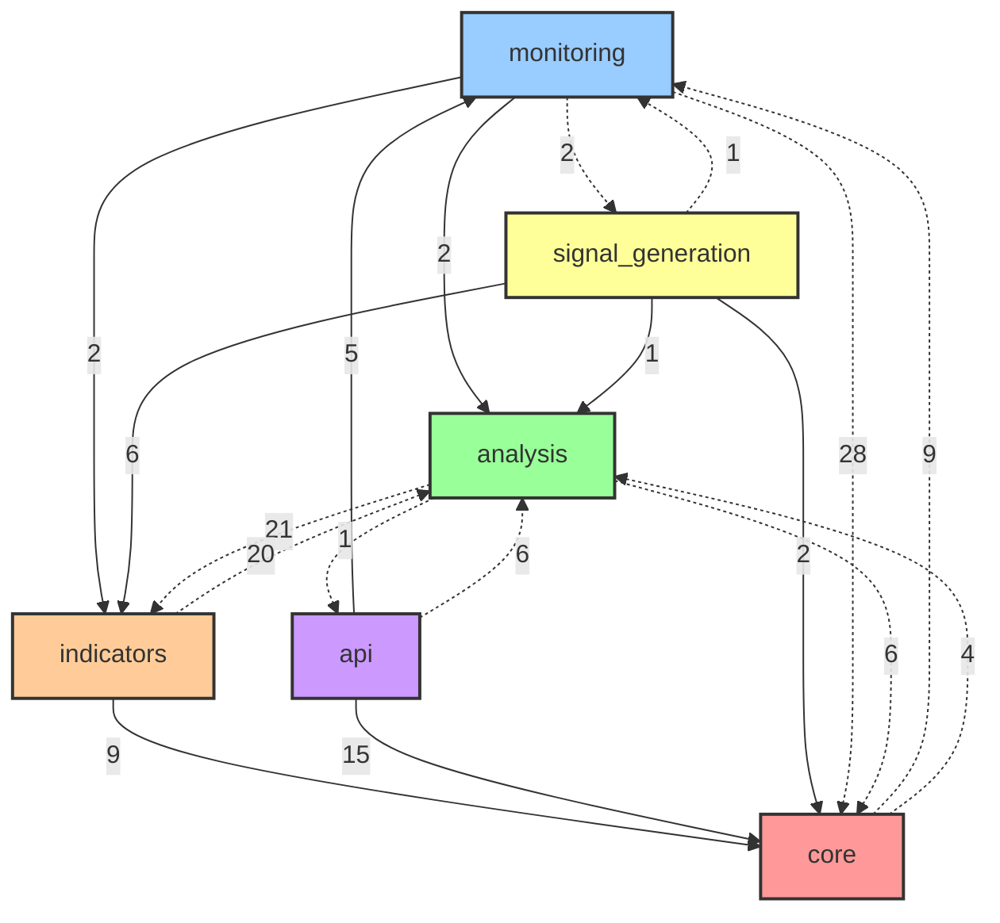

# Circular Dependency Resolution Plan

## Current State Analysis

### Critical Issues Identified

1. **Direct Circular Import**: `indicators.orderflow_indicators` ↔ `analysis.core.confluence`
2. **Core-Monitoring Bidirectional Coupling**: 37 total cross-dependencies
3. **Tight Module Coupling**: 312 total cross-module dependencies across codebase

### Dependency Visualization



## Phase 4 Implementation Plan

### Step 1: Emergency Fix - Break Direct Circular Import

**Problem**: `indicators/orderflow_indicators.py` imports `DataValidator` from `analysis/core/confluence.py`, while `confluence.py` imports `OrderflowIndicators`.

**Solution**:
```python
# Create: src/shared/validation/data_validator.py
class DataValidator:
    """Moved from analysis.core.confluence to break circular dependency."""
    
    @staticmethod
    def validate_data_availability(data: Dict[str, Any], required_fields: List[str]) -> bool:
        """Validate that required data fields are available."""
        for field in required_fields:
            if field not in data or data[field] is None:
                return False
        return True
    
    @staticmethod  
    def validate_data_quality(data: Dict[str, Any], symbol: str) -> bool:
        """Validate data quality metrics."""
        # Move validation logic here
        pass
```

**Files to Update**:
1. Move `DataValidator` from `analysis/core/confluence.py` to `src/shared/validation/data_validator.py`
2. Update import in `indicators/orderflow_indicators.py`: 
   ```python
   # OLD: from src.analysis.core.confluence import DataValidator
   # NEW: from src.shared.validation.data_validator import DataValidator
   ```
3. Update import in `analysis/core/confluence.py`:
   ```python
   # ADD: from src.shared.validation.data_validator import DataValidator
   ```

### Step 2: Create Service Abstraction Layer

**Create**: `src/services/core/alert_service.py`
```python
from abc import ABC, abstractmethod
from typing import Any, Dict, Optional

class AlertServiceInterface(ABC):
    """Abstract interface for alert services."""
    
    @abstractmethod
    async def send_alert(self, alert_data: Dict[str, Any]) -> bool:
        """Send an alert with the given data."""
        pass
    
    @abstractmethod
    async def get_alert_status(self, alert_id: str) -> Optional[Dict[str, Any]]:
        """Get the status of an alert."""
        pass

class AlertService(AlertServiceInterface):
    """Implementation of alert service."""
    
    def __init__(self, discord_webhook: Optional[str] = None):
        self.discord_webhook = discord_webhook
        # Move AlertManager logic here
        
    async def send_alert(self, alert_data: Dict[str, Any]) -> bool:
        # Implementation from current AlertManager
        pass
```

**Create**: `src/services/core/metrics_service.py`
```python
from abc import ABC, abstractmethod
from typing import Dict, Any, List

class MetricsServiceInterface(ABC):
    """Abstract interface for metrics services."""
    
    @abstractmethod
    def record_metric(self, name: str, value: float, tags: Dict[str, str] = None):
        """Record a metric value."""
        pass
    
    @abstractmethod
    def get_metrics(self, name: str = None) -> List[Dict[str, Any]]:
        """Get recorded metrics."""
        pass

class MetricsService(MetricsServiceInterface):
    """Implementation of metrics service."""
    
    def __init__(self):
        # Move MetricsManager logic here
        pass
```

### Step 3: Implement Dependency Injection Container

**Create**: `src/container/service_container.py`
```python
from typing import Dict, Any, Optional, TypeVar, Type, Callable
import inspect

T = TypeVar('T')

class ServiceContainer:
    """Dependency injection container."""
    
    def __init__(self):
        self._services: Dict[str, Any] = {}
        self._factories: Dict[str, Callable] = {}
        self._singletons: Dict[str, Any] = {}
        
    def register(self, interface: Type[T], implementation: Type[T], singleton: bool = True):
        """Register a service implementation."""
        name = interface.__name__
        
        def factory():
            # Auto-inject dependencies based on constructor signature
            sig = inspect.signature(implementation.__init__)
            kwargs = {}
            
            for param_name, param in sig.parameters.items():
                if param_name == 'self':
                    continue
                if param.annotation in self._services:
                    kwargs[param_name] = self.get(param.annotation)
            
            return implementation(**kwargs)
        
        if singleton:
            self._singletons[name] = None
            self._factories[name] = factory
        else:
            self._factories[name] = factory
    
    def get(self, interface: Type[T]) -> T:
        """Get a service instance."""
        name = interface.__name__
        
        if name in self._singletons:
            if self._singletons[name] is None:
                self._singletons[name] = self._factories[name]()
            return self._singletons[name]
        elif name in self._factories:
            return self._factories[name]()
        else:
            raise KeyError(f"Service {name} not registered")

# Global container instance
container = ServiceContainer()
```

### Step 4: Event-Driven Communication

**Create**: `src/events/event_system.py`
```python
from typing import Dict, List, Callable, Any, Type
from abc import ABC, abstractmethod
import asyncio
import logging

class Event(ABC):
    """Base event class."""
    
    def __init__(self):
        self.timestamp = time.time()

class MarketDataUpdated(Event):
    def __init__(self, symbol: str, data: Dict[str, Any]):
        super().__init__()
        self.symbol = symbol
        self.data = data

class AlertGenerated(Event):
    def __init__(self, alert_type: str, message: str, priority: str = "normal"):
        super().__init__()
        self.alert_type = alert_type
        self.message = message
        self.priority = priority

class EventBus:
    """Event bus for decoupled communication."""
    
    def __init__(self):
        self._handlers: Dict[Type[Event], List[Callable]] = {}
        self._logger = logging.getLogger(__name__)
    
    def subscribe(self, event_type: Type[Event], handler: Callable[[Event], None]):
        """Subscribe to an event type."""
        if event_type not in self._handlers:
            self._handlers[event_type] = []
        self._handlers[event_type].append(handler)
    
    def publish(self, event: Event):
        """Publish an event to all subscribers."""
        event_type = type(event)
        if event_type in self._handlers:
            for handler in self._handlers[event_type]:
                try:
                    if asyncio.iscoroutinefunction(handler):
                        asyncio.create_task(handler(event))
                    else:
                        handler(event)
                except Exception as e:
                    self._logger.error(f"Event handler error: {e}")

# Global event bus instance
event_bus = EventBus()
```

### Step 5: Refactor Core Modules

**Update**: `src/core/validation/startup_validator.py`
```python
# OLD IMPORTS:
# from src.monitoring.alert_manager import AlertManager  
# from src.monitoring.metrics_manager import MetricsManager
# from src.monitoring.monitor import MarketMonitor

# NEW IMPORTS:
from src.container.service_container import container
from src.services.core.alert_service import AlertServiceInterface
from src.services.core.metrics_service import MetricsServiceInterface

class StartupValidator:
    def __init__(self):
        # Inject dependencies instead of importing directly
        self.alert_service = container.get(AlertServiceInterface)
        self.metrics_service = container.get(MetricsServiceInterface)
```

**Update**: `src/monitoring/monitor.py`
```python
# Replace direct imports with event subscriptions
from src.events.event_system import event_bus, MarketDataUpdated, AlertGenerated

class MarketMonitor:
    def __init__(self):
        # Subscribe to events instead of direct dependencies
        event_bus.subscribe(MarketDataUpdated, self.handle_market_data_updated)
        
    def handle_market_data_updated(self, event: MarketDataUpdated):
        """Handle market data updates via events."""
        # Process market data
        # Publish alerts via events instead of direct calls
        if self.should_alert(event.data):
            alert_event = AlertGenerated(
                alert_type="market_signal",
                message=f"Signal detected for {event.symbol}",
                priority="high"
            )
            event_bus.publish(alert_event)
```

### Step 6: Module-by-Module Migration

#### 6.1 Monitoring Module Cleanup
**Files to update**:
- `monitoring/alert_manager.py` → Move to `services/core/alert_service.py`
- `monitoring/metrics_manager.py` → Move to `services/core/metrics_service.py`
- `monitoring/monitor.py` → Update to use events and dependency injection

#### 6.2 Core Module Cleanup  
**Files to update**:
- `core/formatting/` → Move to `shared/formatting/`
- `core/validation/startup_validator.py` → Update to use service container
- `core/reporting/pdf_generator.py` → Update to use service abstractions

#### 6.3 Analysis Module Cleanup
**Files to update**:
- `analysis/core/confluence.py` → Remove DataValidator, use shared version
- Create `analysis/services/confluence_service.py` for business logic

#### 6.4 Indicators Module Cleanup
**Files to update**:
- `indicators/orderflow_indicators.py` → Update DataValidator import
- `indicators/base_indicator.py` → Use shared formatting utilities

## Implementation Timeline

### Week 1: Emergency Fixes
- [ ] Move DataValidator to shared module
- [ ] Update orderflow_indicators.py imports
- [ ] Update confluence.py imports  
- [ ] Test to ensure no import errors
- [ ] Verify circular dependency is broken

### Week 2: Infrastructure Setup
- [ ] Create service container
- [ ] Create event bus system
- [ ] Create service interfaces
- [ ] Create shared utilities module
- [ ] Update main.py to use container

### Week 3: Core Migration
- [ ] Move AlertManager to service layer
- [ ] Move MetricsManager to service layer  
- [ ] Update monitoring module to use events
- [ ] Update core validation to use services
- [ ] Test all functionality still works

### Week 4: Full Integration
- [ ] Complete remaining module updates
- [ ] Performance testing
- [ ] Integration testing
- [ ] Documentation updates
- [ ] Final circular dependency verification

## Validation Criteria

### Success Metrics
1. **Zero circular dependencies** detected by analysis tools
2. **All tests pass** after migration
3. **No performance regression** (< 5% slowdown acceptable)
4. **Independent module testing** capability achieved

### Test Plan
1. **Unit Tests**: Each module can be tested in isolation
2. **Integration Tests**: All functionality works end-to-end  
3. **Performance Tests**: No significant slowdown
4. **Dependency Analysis**: Re-run circular dependency analysis

## Risk Mitigation

### Risk: Breaking Changes
**Mitigation**: 
- Implement changes incrementally
- Maintain backward compatibility during transition
- Comprehensive testing at each step

### Risk: Performance Impact
**Mitigation**:
- Profile before and after changes
- Optimize service container for performance  
- Use lazy loading where appropriate

### Risk: Developer Confusion
**Mitigation**:
- Clear documentation of new patterns
- Code examples for common scenarios
- Gradual migration with clear checkpoints

## Expected Benefits

1. **Improved Testability**: Modules can be tested independently
2. **Better Maintainability**: Clear separation of concerns
3. **Enhanced Scalability**: Easier to add new features
4. **Reduced Technical Debt**: Cleaner architecture
5. **Better Developer Experience**: Easier to understand and modify code

This plan addresses the critical circular dependency issues while establishing a foundation for long-term architectural improvements.