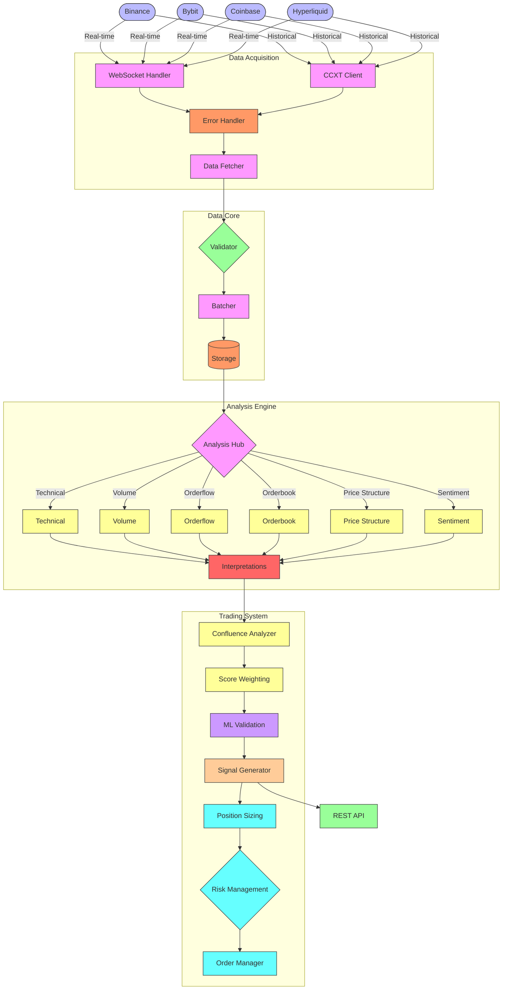

# System Architecture

This document outlines the architectural design of our trading system.

## System Flow Diagram

## Component Descriptions

### Data Sources
- **Exchanges**: Binance, Bybit, Coinbase, and Hyperliquid provide both real-time and historical market data

### Data Acquisition
- **WebSocket Handler**: Processes real-time data streams from exchanges
- **CCXT Client**: Fetches historical data and provides standardized access to exchange APIs
- **Error Handler**: Manages error detection, logging, and recovery strategies
- **Data Fetcher**: Standardizes data formats from different sources

### Data Core
- **Validator**: Ensures data integrity and quality
- **Batcher**: Aggregates and organizes data for efficient storage
- **Storage**: Unified storage interface for both cache (Redis) and permanent storage (PostgreSQL)

### Analysis Engine
- **Analysis Hub**: Central coordinator for all analysis modules
- **Analysis Modules**: Specialized components for different analysis types
- **Interpretations**: Consolidates findings from all analysis modules

### Trading System
- **Confluence Analyzer**: Identifies agreement across multiple analysis dimensions
- **Score Weighting**: Applies appropriate importance to different signals
- **ML Validation**: Uses machine learning to validate signal quality
- **Signal Generator**: Creates actionable trading signals
- **Position Sizing**: Determines appropriate position size based on risk parameters
- **Risk Management**: Applies risk constraints and checks
- **Order Manager**: Handles the execution logistics of trades

### API
- **REST API**: Provides external access to signals and system data 