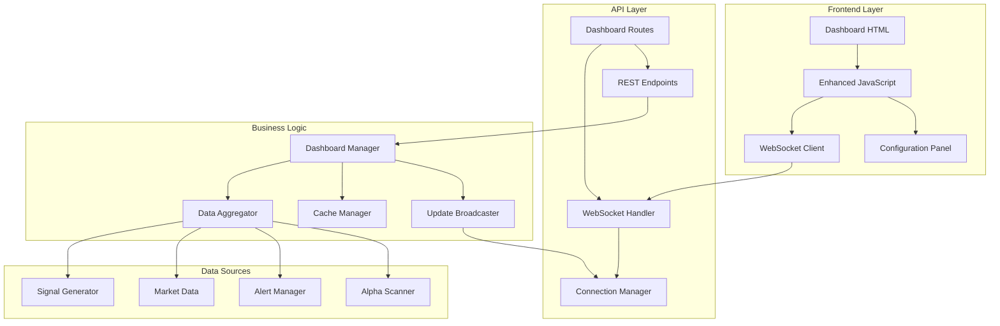
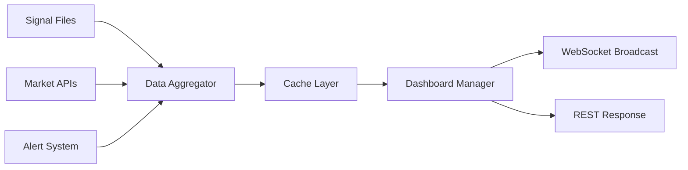

# Virtuoso Trading Dashboard - Comprehensive Technical Guide

## Table of Contents
1. [Overview](#overview)
2. [Architecture](#architecture)
3. [Component Breakdown](#component-breakdown)
4. [API Documentation](#api-documentation)
5. [Frontend Architecture](#frontend-architecture)
6. [Real-time Communication](#real-time-communication)
7. [Data Flow](#data-flow)
8. [Configuration Management](#configuration-management)
9. [Installation & Setup](#installation--setup)
10. [Usage Guide](#usage-guide)
11. [Performance Optimization](#performance-optimization)
12. [Security Considerations](#security-considerations)
13. [Troubleshooting](#troubleshooting)
14. [Future Enhancements](#future-enhancements)

---

## Overview

The Virtuoso Trading Dashboard is a comprehensive, real-time trading intelligence platform that aggregates market data, signals, alerts, and alpha opportunities into a unified interface. Built with modern web technologies, it provides traders and analysts with instant access to critical market information through an intuitive, terminal-style interface.

### Key Features
- **Real-time Updates**: 15-second WebSocket updates for live data
- **Comprehensive Data Integration**: Signals, market data, alerts, alpha opportunities
- **Interactive UI**: Professional terminal amber theme with hover effects and animations
- **Configuration Management**: Adjustable thresholds and monitoring parameters
- **Responsive Design**: Works seamlessly across desktop and mobile devices
- **Performance Optimized**: Caching, parallel data fetching, and efficient updates
- **Error Resilience**: Graceful degradation and automatic reconnection

### Technology Stack
- **Backend**: FastAPI with WebSocket support
- **Frontend**: Vanilla JavaScript with modern ES6+ features
- **Styling**: Custom CSS with CSS Grid and Flexbox
- **Real-time**: WebSocket communication
- **Data Sources**: JSON files, exchange APIs, monitoring systems

---

## Architecture



### System Components

#### 1. **Frontend Layer**
- **Dashboard HTML**: Static template with modern UI components
- **Enhanced JavaScript**: Dynamic functionality and WebSocket handling
- **Configuration Panel**: Real-time settings management

#### 2. **API Layer**
- **Dashboard Routes**: RESTful endpoints for data access
- **WebSocket Handler**: Real-time communication management
- **Connection Manager**: WebSocket lifecycle and broadcasting

#### 3. **Business Logic**
- **Dashboard Manager**: Central coordination hub
- **Data Aggregator**: Multi-source data collection
- **Cache Manager**: Performance optimization layer
- **Update Broadcaster**: Real-time update distribution

#### 4. **Data Sources**
- **Signal Generator**: Trading signal analysis
- **Market Data**: Exchange and market information
- **Alert Manager**: System notifications and alerts
- **Alpha Scanner**: Opportunity detection system

---

## Component Breakdown

### 1. Dashboard Manager (`src/dashboard/dashboard_manager.py`)

The central orchestration component that coordinates all dashboard functionality.

**Key Responsibilities:**
- Data aggregation from multiple sources
- Real-time update broadcasting
- WebSocket connection management
- Caching and performance optimization
- Configuration management

**Core Methods:**
```python
class DashboardManager:
    async def start()                          # Initialize and start services
    async def stop()                           # Graceful shutdown
    async def get_dashboard_overview()         # Aggregate all dashboard data
    async def _update_loop()                   # Background update cycle
    async def _broadcast_updates()             # Send updates to WebSockets
    def add_websocket(websocket)               # Register WebSocket connection
    def remove_websocket(websocket)            # Unregister WebSocket connection
```

**Data Aggregation Pipeline:**
1. **Parallel Data Fetching**: Uses `asyncio.gather()` for concurrent data collection
2. **Exception Handling**: Graceful degradation when data sources fail
3. **Caching Strategy**: 30-second TTL cache to reduce load
4. **Update Broadcasting**: Efficient WebSocket message distribution

### 2. API Routes (`src/api/routes/dashboard.py`)

FastAPI-based REST and WebSocket endpoints for dashboard communication.

**REST Endpoints:**
- `GET /api/dashboard/overview` - Complete dashboard data
- `GET /api/dashboard/alerts/recent` - Recent alerts with filtering
- `GET /api/dashboard/config` - Current configuration
- `POST /api/dashboard/config` - Update configuration
- `GET /api/dashboard/health` - Health check

**WebSocket Endpoint:**
- `WS /api/dashboard/ws` - Real-time updates

**Data Models:**
```python
class DashboardOverview(BaseModel):
    timestamp: str
    signals: List[Dict[str, Any]]
    market: Dict[str, Any]
    alerts: List[AlertItem]
    alpha_opportunities: List[AlphaOpportunity]
    system_status: Dict[str, Any]

class AlertItem(BaseModel):
    type: str
    message: str
    priority: str = "medium"
    timestamp: str
    source: str = "system"

class AlphaOpportunity(BaseModel):
    symbol: str
    pattern: str
    confidence: float
    alpha_potential: float
    timestamp: str
```

### 3. Frontend Template (`src/dashboard/templates/dashboard.html`)

Modern, responsive HTML template with terminal-style aesthetics.

**Layout Structure:**
```html
<div class="dashboard-container">
    <header class="header">
        <!-- Navigation and status indicators -->
    </header>
    
    <div class="dashboard-grid">
        <!-- 4-panel layout with CSS Grid -->
        <div class="panel signals-panel">🎯 Latest Signals</div>
        <div class="panel alpha-panel">⚡ Alpha Opportunities</div>
        <div class="panel market-panel">📊 Market Overview</div>
        <div class="panel alerts-panel">🚨 Recent Alerts</div>
    </div>
    
    <div class="config-panel">
        <!-- Sliding configuration panel -->
    </div>
</div>
```

**CSS Features:**
- **CSS Custom Properties**: Consistent theming with `--accent-orange`, `--bg-primary`, etc.
- **CSS Grid Layout**: Responsive 2x2 grid that adapts to mobile
- **Animations**: Blinking cursor, pulse effects, slide transitions
- **Terminal Aesthetic**: Monospace fonts, dark theme, orange accents
- **Responsive Design**: Mobile-first approach with breakpoints

### 4. Enhanced JavaScript (`src/static/js/dashboard-enhanced.js`)

Comprehensive client-side functionality with modern JavaScript features.

**Core Class Structure:**
```javascript
class VirtuosoDashboard {
    constructor()                              // Initialize dashboard
    async init()                               // Setup and connect
    setupEventListeners()                      // UI event handling
    connectWebSocket()                         // WebSocket connection
    handleWebSocketMessage(data)               // Process real-time updates
    updateDashboard(data)                      // Update UI components
    // ... panel-specific update methods
}
```

**Key Features:**
- **WebSocket Management**: Auto-reconnection with exponential backoff
- **Error Handling**: Graceful degradation and user notifications
- **Configuration**: Real-time settings management
- **Performance**: Efficient DOM updates and memory management
- **Accessibility**: Keyboard shortcuts and responsive design

---

## API Documentation

### REST Endpoints

#### GET `/api/dashboard/overview`
**Description**: Retrieve comprehensive dashboard data

**Parameters:**
- `timeframe` (query, optional): Data aggregation timeframe (default: "4h")

**Response:**
```json
{
    "timestamp": "2024-01-15T10:30:00Z",
    "signals": [
        {
            "symbol": "BTCUSDT",
            "signal": "BUY",
            "score": 85.2,
            "timestamp": "2024-01-15T10:25:00Z",
            "filename": "BTCUSDT_BUY_20240115_102500.json"
        }
    ],
    "market": {
        "active_pairs": 47,
        "avg_volume": 2800000000,
        "market_cap": 1200000000000,
        "volatility": 3.2,
        "regime": "BULLISH",
        "last_updated": "2024-01-15T10:30:00Z"
    },
    "alerts": [
        {
            "type": "SIGNAL",
            "message": "Strong buy signal detected for BTCUSDT",
            "priority": "high",
            "timestamp": "2024-01-15T10:28:00Z",
            "source": "signal_generator"
        }
    ],
    "alpha_opportunities": [
        {
            "symbol": "AVAXUSDT",
            "pattern": "Breakout Pattern",
            "confidence": 0.892,
            "alpha_potential": 0.124,
            "timestamp": "2024-01-15T10:30:00Z"
        }
    ],
    "system_status": {
        "status": "online",
        "uptime": "24h 15m",
        "cpu_usage": 45.2,
        "memory_usage": 68.7,
        "active_connections": 12,
        "last_scan": "2024-01-15T10:30:00Z"
    }
}
```

#### GET `/api/dashboard/alerts/recent`
**Description**: Retrieve recent alerts with optional filtering

**Parameters:**
- `limit` (query): Number of alerts to return (1-100, default: 20)
- `priority` (query): Filter by priority (low, medium, high)
- `alert_type` (query): Filter by alert type (SIGNAL, ALPHA, SYSTEM, MARKET)

**Response:**
```json
[
    {
        "type": "SIGNAL",
        "message": "Strong buy signal detected for BTCUSDT",
        "priority": "high",
        "timestamp": "2024-01-15T10:28:00Z",
        "source": "signal_generator"
    }
]
```

#### GET `/api/dashboard/config`
**Description**: Retrieve current dashboard configuration

**Response:**
```json
{
    "monitoring": {
        "scan_interval": 5,
        "max_alerts": 3,
        "alert_cooldown": 60
    },
    "signals": {
        "min_score": 65,
        "min_reliability": 75
    },
    "alpha": {
        "confidence_threshold": 75,
        "risk_level": "Medium"
    }
}
```

#### POST `/api/dashboard/config`
**Description**: Update dashboard configuration

**Request Body:**
```json
{
    "monitoring": {
        "scan_interval": 5,
        "max_alerts": 3,
        "alert_cooldown": 60
    },
    "signals": {
        "min_score": 65,
        "min_reliability": 75
    },
    "alpha": {
        "confidence_threshold": 75,
        "risk_level": "Medium"
    }
}
```

**Response:**
```json
{
    "status": "success",
    "message": "Configuration updated successfully",
    "timestamp": "2024-01-15T10:30:00Z"
}
```

### WebSocket Communication

#### Connection: `WS /api/dashboard/ws`

**Message Types:**

1. **Dashboard Update**
```json
{
    "type": "dashboard_update",
    "data": {
        // Same structure as GET /overview response
    },
    "timestamp": "2024-01-15T10:30:00Z"
}
```

2. **New Signal**
```json
{
    "type": "new_signal",
    "signal": {
        "symbol": "ETHUSDT",
        "signal": "SELL",
        "score": 78.5,
        "timestamp": "2024-01-15T10:30:00Z"
    }
}
```

3. **New Alert**
```json
{
    "type": "new_alert",
    "alert": {
        "type": "MARKET",
        "message": "Volume spike detected",
        "priority": "medium",
        "timestamp": "2024-01-15T10:30:00Z"
    }
}
```

4. **Alpha Opportunity**
```json
{
    "type": "alpha_opportunity",
    "opportunity": {
        "symbol": "SOLUSDT",
        "pattern": "Support Bounce",
        "confidence": 0.756,
        "alpha_potential": 0.089
    }
}
```

---

## Frontend Architecture

### CSS Architecture

**Design System:**
```css
:root {
    /* Terminal Color Palette */
    --bg-primary: #0d1117;      /* Deep space black */
    --bg-secondary: #1e1e1e;    /* Panel background */
    --bg-tertiary: #252525;     /* Card background */
    --border-color: #333;       /* Subtle borders */
    --text-primary: #e6edf3;    /* Primary text */
    --text-secondary: #8b949e;  /* Secondary text */
    --accent-orange: #FF6600;   /* Brand accent */
    --success-green: #3fb950;   /* Success states */
    --error-red: #f85149;       /* Error states */
    --warning-yellow: #d29922;  /* Warning states */
    --font-mono: 'Courier New', 'Monaco', 'Menlo', monospace;
}
```

**Layout System:**
- **CSS Grid**: Primary layout mechanism for responsive design
- **Flexbox**: Component-level alignment and distribution
- **Container Queries**: Future-ready responsive design
- **Custom Properties**: Dynamic theming and consistency

### JavaScript Architecture

**Event-Driven Design:**
```javascript
// Event handling pattern
document.addEventListener('DOMContentLoaded', () => {
    dashboardInstance = new VirtuosoDashboard();
});

document.addEventListener('visibilitychange', () => {
    // Handle page visibility changes
});

window.addEventListener('beforeunload', () => {
    // Cleanup on page unload
});
```

**Error Handling Strategy:**
```javascript
// Global error handling
window.addEventListener('error', (event) => {
    console.error('Uncaught error:', event.error);
    if (dashboardInstance) {
        dashboardInstance.showNotification(
            'An error occurred. Check console for details.', 
            'error'
        );
    }
});

// Promise rejection handling
window.addEventListener('unhandledrejection', (event) => {
    console.error('Unhandled promise rejection:', event.reason);
});
```

**Memory Management:**
- **Event Listener Cleanup**: Proper removal of event listeners
- **WebSocket Management**: Connection lifecycle management
- **DOM Update Optimization**: Efficient DOM manipulation
- **Garbage Collection**: Avoid memory leaks in long-running sessions

---

## Real-time Communication

### WebSocket Implementation

**Connection Management:**
```javascript
class VirtuosoDashboard {
    connectWebSocket() {
        const protocol = window.location.protocol === 'https:' ? 'wss:' : 'ws:';
        const wsUrl = `${protocol}//${window.location.host}/api/dashboard/ws`;
        
        this.websocket = new WebSocket(wsUrl);
        
        this.websocket.onopen = () => {
            this.reconnectAttempts = 0;
            this.updateConnectionStatus('online');
        };
        
        this.websocket.onmessage = (event) => {
            const data = JSON.parse(event.data);
            this.handleWebSocketMessage(data);
        };
        
        this.websocket.onclose = () => {
            this.updateConnectionStatus('error');
            this.attemptReconnect();
        };
    }
}
```

**Reconnection Strategy:**
- **Exponential Backoff**: Increasing delays between reconnection attempts
- **Maximum Attempts**: Prevents infinite reconnection loops
- **Connection State Tracking**: Visual indicators for connection status
- **Heartbeat Mechanism**: Periodic ping to maintain connection

**Backend WebSocket Handler:**
```python
@router.websocket("/ws")
async def dashboard_websocket(websocket: WebSocket):
    await manager.connect(websocket)
    
    try:
        # Send initial data
        overview = await get_dashboard_overview(mock_request)
        await websocket.send_json({
            "type": "dashboard_update",
            "data": overview.dict()
        })
        
        # Keep connection alive with periodic updates
        while True:
            await asyncio.sleep(15)  # 15-second update interval
            
            overview = await get_dashboard_overview(mock_request)
            await websocket.send_json({
                "type": "dashboard_update",
                "data": overview.dict(),
                "timestamp": datetime.utcnow().isoformat()
            })
    except WebSocketDisconnect:
        pass
    finally:
        manager.disconnect(websocket)
```

### Update Broadcasting

**Connection Manager:**
```python
class ConnectionManager:
    def __init__(self):
        self.active_connections: List[WebSocket] = []
    
    async def connect(self, websocket: WebSocket):
        await websocket.accept()
        self.active_connections.append(websocket)
    
    def disconnect(self, websocket: WebSocket):
        if websocket in self.active_connections:
            self.active_connections.remove(websocket)
    
    async def send_to_all(self, message: dict):
        disconnected = []
        for connection in self.active_connections:
            try:
                await connection.send_json(message)
            except Exception:
                disconnected.append(connection)
        
        # Clean up disconnected connections
        for connection in disconnected:
            self.disconnect(connection)
```

---

## Data Flow

### Data Aggregation Pipeline



**Data Sources:**
1. **Signal Files**: JSON files in `reports/json/` directory
2. **Market APIs**: Real-time market data from exchanges
3. **Alert System**: System-generated alerts and notifications
4. **Metrics System**: Performance and system metrics

**Processing Pipeline:**
1. **Collection**: Parallel data fetching with `asyncio.gather()`
2. **Validation**: Data structure validation and error handling
3. **Transformation**: Formatting and enrichment
4. **Caching**: TTL-based caching for performance
5. **Distribution**: WebSocket broadcasting and REST responses

### Cache Strategy

**Multi-Level Caching:**
- **Application Cache**: 30-second TTL for dashboard overview
- **HTTP Cache**: Browser caching for static assets
- **WebSocket State**: Connection-specific state management

**Cache Invalidation:**
- **Time-Based**: TTL expiration
- **Event-Driven**: New data triggers cache refresh
- **Manual**: Configuration changes force refresh

---

## Configuration Management

### Configuration Schema

```json
{
    "monitoring": {
        "scan_interval": 5,        // Minutes between scans
        "max_alerts": 3,           // Maximum alerts per scan
        "alert_cooldown": 60       // Minutes between similar alerts
    },
    "signals": {
        "min_score": 65,           // Minimum signal score threshold
        "min_reliability": 75      // Minimum reliability threshold
    },
    "alpha": {
        "confidence_threshold": 75, // Minimum confidence for alpha opportunities
        "risk_level": "Medium"     // Risk tolerance (Low, Medium, High)
    }
}
```

### Configuration UI

**Dynamic Configuration Panel:**
- **Slide-out Interface**: Non-intrusive configuration access
- **Real-time Validation**: Client-side validation before submission
- **Immediate Feedback**: Success/error notifications
- **Persistence**: Server-side configuration storage

**Configuration Workflow:**
1. User opens configuration panel
2. Current settings loaded from server
3. User modifies settings with validation
4. Settings submitted to server
5. Server validates and applies changes
6. Confirmation sent to user
7. UI updates reflect new settings

---

## Installation & Setup

### Prerequisites

```bash
# Python 3.11+
python --version

# Virtual environment
python -m venv venv311
source venv311/bin/activate  # Linux/Mac
# or
venv311\Scripts\activate     # Windows

# Install dependencies
pip install -r requirements.txt
```

### File Structure

```
src/
├── dashboard/
│   ├── __init__.py
│   ├── dashboard_manager.py
│   └── templates/
│       └── dashboard.html
├── api/
│   ├── __init__.py
│   └── routes/
│       └── dashboard.py
├── static/
│   └── js/
│       └── dashboard-enhanced.js
└── main.py
```

### Environment Configuration

```bash
# .env file
DASHBOARD_UPDATE_INTERVAL=15
DASHBOARD_CACHE_TTL=30
WEBSOCKET_TIMEOUT=300
```

### Database Setup (Optional)

```sql
-- Configuration storage table
CREATE TABLE dashboard_config (
    id SERIAL PRIMARY KEY,
    config_key VARCHAR(255) UNIQUE NOT NULL,
    config_value JSONB NOT NULL,
    updated_at TIMESTAMP DEFAULT CURRENT_TIMESTAMP
);
```

### Integration with Main Application

```python
# main.py integration
from src.dashboard import DashboardManager

# Initialize dashboard manager
dashboard_manager = DashboardManager(
    exchange_manager=exchange_manager,
    alert_manager=alert_manager,
    metrics_manager=metrics_manager,
    top_symbols_manager=top_symbols_manager,
    signal_generator=signal_generator,
    config=config
)

# Start dashboard services
await dashboard_manager.start()

# Add to app state for dependency injection
app.state.dashboard_manager = dashboard_manager
```

---

## Usage Guide

### Accessing the Dashboard

1. **Direct URL**: Navigate to `http://localhost:8000/dashboard`
2. **API Endpoints**: Access data via REST APIs at `/api/dashboard/*`
3. **WebSocket**: Connect to `ws://localhost:8000/api/dashboard/ws`

### Dashboard Interface

**Main Panels:**

1. **🎯 Latest Signals**
   - Recent trading signals with scores
   - Color-coded signal types (BUY/SELL/HOLD)
   - Click for detailed signal analysis
   - Real-time updates every 15 seconds

2. **⚡ Alpha Opportunities**
   - High-confidence trading opportunities
   - Pattern recognition indicators
   - Confidence and alpha potential metrics
   - Click for opportunity details

3. **📊 Market Overview**
   - Market regime indicators
   - Volume and volatility metrics
   - Active trading pairs count
   - Market capitalization data

4. **🚨 Recent Alerts**
   - System and trading alerts
   - Priority-based color coding
   - Source attribution
   - Timestamp information

**Configuration Panel:**

Access via the ⚙️ Config button in the header.

- **Monitoring Settings**: Scan intervals and alert thresholds
- **Signal Thresholds**: Minimum scores and reliability
- **Alpha Scanning**: Confidence thresholds and risk levels
- **Save/Reset**: Persistent configuration management

### Keyboard Shortcuts

- `Escape`: Close configuration panel
- `Ctrl+R`: Refresh dashboard data
- `F5`: Full page refresh

### Mobile Usage

The dashboard is fully responsive and optimized for mobile devices:
- **Touch-friendly**: Large touch targets and gestures
- **Responsive Layout**: Single-column layout on mobile
- **Optimized Performance**: Reduced update frequency on mobile
- **Battery Conscious**: Efficient rendering and networking

---

## Performance Optimization

### Frontend Optimizations

**Efficient DOM Updates:**
```javascript
// Batch DOM updates
updateSignalsPanel(signals) {
    const fragment = document.createDocumentFragment();
    signals.forEach(signal => {
        const element = this.createSignalElement(signal);
        fragment.appendChild(element);
    });
    container.innerHTML = '';
    container.appendChild(fragment);
}
```

**Memory Management:**
```javascript
// Cleanup on page unload
window.addEventListener('beforeunload', () => {
    if (dashboardInstance && dashboardInstance.websocket) {
        dashboardInstance.websocket.close();
    }
});
```

**Network Optimization:**
- **WebSocket Compression**: Automatic compression for large payloads
- **Update Batching**: Group multiple updates into single messages
- **Conditional Updates**: Only send changed data
- **Connection Pooling**: Efficient connection reuse

### Backend Optimizations

**Caching Strategy:**
```python
class DashboardManager:
    async def get_dashboard_overview(self) -> Dict[str, Any]:
        # Check cache first
        if (self._cached_data and self._last_update and 
            (datetime.utcnow() - self._last_update).seconds < self._cache_ttl):
            return self._cached_data
        
        # Fetch fresh data
        data = await self._fetch_fresh_data()
        self._cached_data = data
        self._last_update = datetime.utcnow()
        return data
```

**Parallel Data Fetching:**
```python
async def get_dashboard_overview(self):
    tasks = [
        self._get_signals_data(),
        self._get_market_data(),
        self._get_alerts_data(),
        self._get_alpha_opportunities(),
        self._get_system_status()
    ]
    
    results = await asyncio.gather(*tasks, return_exceptions=True)
    return self._process_results(results)
```

**Database Optimization:**
- **Connection Pooling**: Efficient database connections
- **Query Optimization**: Indexed queries and efficient joins
- **Batch Operations**: Group database operations
- **Read Replicas**: Separate read/write operations

### Monitoring and Metrics

**Performance Metrics:**
- **Response Times**: API endpoint performance
- **WebSocket Latency**: Real-time update delays
- **Memory Usage**: Frontend and backend memory consumption
- **Connection Count**: Active WebSocket connections
- **Error Rates**: Failed requests and connection drops

**Alerting:**
```python
# Performance alert example
if response_time > threshold:
    await alert_manager.send_alert(
        level="WARNING",
        message=f"Dashboard response time exceeded threshold: {response_time}ms",
        details={"endpoint": endpoint, "threshold": threshold}
    )
```

---

## Security Considerations

### Authentication & Authorization

**JWT Token Integration:**
```python
from fastapi import Depends, HTTPException
from fastapi.security import HTTPBearer

security = HTTPBearer()

@router.get("/overview")
async def get_dashboard_overview(
    token: str = Depends(security)
):
    # Validate JWT token
    user = await validate_token(token)
    if not user:
        raise HTTPException(status_code=401, detail="Invalid token")
    
    # Check permissions
    if not user.has_permission("dashboard:read"):
        raise HTTPException(status_code=403, detail="Insufficient permissions")
    
    return await dashboard_manager.get_dashboard_overview()
```

**WebSocket Authentication:**
```python
@router.websocket("/ws")
async def dashboard_websocket(
    websocket: WebSocket,
    token: str = Query(...)
):
    # Validate token before accepting connection
    user = await validate_token(token)
    if not user:
        await websocket.close(code=1008, reason="Invalid token")
        return
    
    await manager.connect(websocket)
```

### Data Protection

**Input Validation:**
```python
from pydantic import BaseModel, validator

class DashboardConfig(BaseModel):
    monitoring: Dict[str, Any]
    
    @validator('monitoring')
    def validate_monitoring(cls, v):
        scan_interval = v.get('scan_interval', 5)
        if not isinstance(scan_interval, int) or scan_interval < 1 or scan_interval > 60:
            raise ValueError('scan_interval must be between 1 and 60 minutes')
        return v
```

**Output Sanitization:**
```javascript
// Prevent XSS attacks
function sanitizeHTML(str) {
    const div = document.createElement('div');
    div.textContent = str;
    return div.innerHTML;
}

// Use when updating DOM
element.innerHTML = sanitizeHTML(userInput);
```

**CORS Configuration:**
```python
from fastapi.middleware.cors import CORSMiddleware

app.add_middleware(
    CORSMiddleware,
    allow_origins=["https://dashboard.virtuoso.com"],
    allow_credentials=True,
    allow_methods=["GET", "POST"],
    allow_headers=["*"],
)
```

### Rate Limiting

**API Rate Limiting:**
```python
from slowapi import Limiter, _rate_limit_exceeded_handler
from slowapi.util import get_remote_address

limiter = Limiter(key_func=get_remote_address)

@router.get("/overview")
@limiter.limit("30/minute")
async def get_dashboard_overview(request: Request):
    # Rate limited to 30 requests per minute
    pass
```

**WebSocket Connection Limits:**
```python
class ConnectionManager:
    def __init__(self, max_connections: int = 100):
        self.max_connections = max_connections
        self.active_connections: List[WebSocket] = []
    
    async def connect(self, websocket: WebSocket):
        if len(self.active_connections) >= self.max_connections:
            await websocket.close(code=1013, reason="Too many connections")
            return False
        
        await websocket.accept()
        self.active_connections.append(websocket)
        return True
```

---

## Troubleshooting

### Common Issues

#### 1. WebSocket Connection Failures

**Symptoms:**
- "Connection failed" status indicator
- No real-time updates
- Console errors about WebSocket

**Solutions:**
```javascript
// Check WebSocket support
if (!window.WebSocket) {
    console.error('WebSocket not supported in this browser');
    // Fallback to polling
    this.startPolling();
}

// Debug connection issues
this.websocket.onerror = (error) => {
    console.error('WebSocket error:', error);
    // Check network connectivity
    // Verify server is running
    // Check firewall settings
};
```

#### 2. Data Loading Issues

**Symptoms:**
- "Loading..." states persist
- Empty panels
- API errors in console

**Solutions:**
```python
# Backend debugging
@router.get("/overview")
async def get_dashboard_overview():
    try:
        logger.info("Dashboard overview requested")
        data = await dashboard_manager.get_dashboard_overview()
        logger.info(f"Returning {len(data)} data points")
        return data
    except Exception as e:
        logger.error(f"Dashboard overview error: {str(e)}")
        logger.debug(traceback.format_exc())
        raise HTTPException(status_code=500, detail=str(e))
```

#### 3. Performance Issues

**Symptoms:**
- Slow page loading
- High memory usage
- Laggy UI updates

**Solutions:**
```javascript
// Optimize update frequency
if (document.hidden) {
    // Reduce update frequency when tab is hidden
    this.updateInterval = 60; // 1 minute
} else {
    this.updateInterval = 15; // 15 seconds
}

// Memory leak detection
setInterval(() => {
    if (performance.memory) {
        console.log('Memory usage:', {
            used: performance.memory.usedJSHeapSize,
            total: performance.memory.totalJSHeapSize,
            limit: performance.memory.jsHeapSizeLimit
        });
    }
}, 30000);
```

### Diagnostic Tools

**Health Check Endpoint:**
```python
@router.get("/health")
async def dashboard_health_check():
    return {
        "status": "healthy",
        "timestamp": datetime.utcnow().isoformat(),
        "active_connections": len(manager.active_connections),
        "cache_status": "hit" if dashboard_manager._cached_data else "miss",
        "last_update": dashboard_manager._last_update.isoformat() if dashboard_manager._last_update else None
    }
```

**Frontend Debugging:**
```javascript
// Enable debug mode
window.dashboard.enableDebug = true;

// Check connection status
console.log('Connection status:', window.dashboard.getConnectionStatus());

// Check last update
console.log('Last update:', window.dashboard.getLastUpdate());

// Check configuration
console.log('Current config:', window.dashboard.getCurrentConfig());
```

### Error Logging

**Structured Logging:**
```python
import structlog

logger = structlog.get_logger()

@router.get("/overview")
async def get_dashboard_overview():
    logger.info(
        "dashboard_overview_requested",
        endpoint="/overview",
        user_id=user.id if user else None,
        timestamp=datetime.utcnow().isoformat()
    )
```

**Error Tracking:**
```javascript
// Global error handler
window.addEventListener('error', (event) => {
    const errorData = {
        message: event.error.message,
        stack: event.error.stack,
        filename: event.filename,
        lineno: event.lineno,
        colno: event.colno,
        timestamp: new Date().toISOString(),
        userAgent: navigator.userAgent,
        url: window.location.href
    };
    
    // Send to error tracking service
    fetch('/api/errors', {
        method: 'POST',
        headers: { 'Content-Type': 'application/json' },
        body: JSON.stringify(errorData)
    });
});
```

---

## Future Enhancements

### Short-term Improvements (Next 3 months)

1. **Enhanced Filtering & Search**
   - Advanced signal filtering by symbol, score, timeframe
   - Search functionality across all panels
   - Custom alert rules and notifications

2. **Customizable Layouts**
   - Drag-and-drop panel arrangement
   - Resizable panels
   - Custom dashboard views for different user roles

3. **Export Functionality**
   - PDF report generation
   - CSV data export
   - Chart screenshot capabilities

4. **Mobile App**
   - Native iOS/Android apps
   - Push notifications
   - Offline functionality

### Medium-term Enhancements (3-6 months)

1. **Advanced Analytics**
   - Historical trend analysis
   - Performance attribution
   - Risk metrics and alerts

2. **AI Integration**
   - Natural language queries
   - Predictive analytics
   - Anomaly detection

3. **Collaboration Features**
   - Shared dashboards
   - Comment system
   - Team notifications

4. **Advanced Visualizations**
   - Interactive charts
   - Heatmaps and treemaps
   - 3D visualizations

### Long-term Vision (6+ months)

1. **Multi-Exchange Support**
   - Unified view across exchanges
   - Cross-exchange arbitrage opportunities
   - Exchange performance comparison

2. **Advanced Risk Management**
   - Portfolio risk analysis
   - Stress testing
   - Regulatory compliance

3. **Machine Learning Pipeline**
   - Automated pattern recognition
   - Signal quality scoring
   - Adaptive thresholds

4. **Enterprise Features**
   - Multi-tenant architecture
   - RBAC (Role-Based Access Control)
   - Audit logging
   - SLA monitoring

### Technical Roadmap

**Performance Optimizations:**
- WebAssembly for compute-intensive operations
- Service Worker for offline functionality
- CDN integration for global distribution
- Database sharding for scalability

**Security Enhancements:**
- OAuth 2.0 / OpenID Connect integration
- End-to-end encryption for sensitive data
- Advanced threat detection
- Compliance certifications (SOC 2, ISO 27001)

**Monitoring & Observability:**
- Distributed tracing
- Advanced metrics and alerting
- Performance monitoring
- User behavior analytics

---

## Conclusion

The Virtuoso Trading Dashboard represents a comprehensive solution for real-time trading intelligence, combining modern web technologies with robust backend services to deliver a professional-grade trading interface. Its modular architecture, performance optimizations, and extensive feature set make it suitable for both individual traders and institutional use.

The system's emphasis on real-time updates, intuitive design, and extensibility ensures it can evolve with changing market needs and technological advances. With proper implementation of the security considerations and performance optimizations outlined in this guide, the dashboard can serve as a reliable foundation for trading operations at any scale.

For support, questions, or contributions to the dashboard system, please refer to the project's GitHub repository and documentation.

---

## Appendix

### A. Configuration Reference

```yaml
# Complete configuration example
dashboard:
  update_interval: 15
  cache_ttl: 30
  max_connections: 100
  
monitoring:
  scan_interval: 5
  max_alerts: 3
  alert_cooldown: 60
  
signals:
  min_score: 65
  min_reliability: 75
  
alpha:
  confidence_threshold: 75
  risk_level: "Medium"
  
security:
  jwt_secret: "${JWT_SECRET}"
  session_timeout: 3600
  
performance:
  enable_caching: true
  cache_size: 1000
  connection_pool_size: 20
```

### B. API Rate Limits

| Endpoint | Rate Limit | Window |
|----------|------------|--------|
| `/api/dashboard/overview` | 30 requests | 1 minute |
| `/api/dashboard/alerts/recent` | 60 requests | 1 minute |
| `/api/dashboard/config` (GET) | 10 requests | 1 minute |
| `/api/dashboard/config` (POST) | 5 requests | 1 minute |
| WebSocket connections | 10 connections | Per IP |

### C. Browser Compatibility

| Browser | Minimum Version | WebSocket Support |
|---------|----------------|-------------------|
| Chrome | 80+ | ✅ |
| Firefox | 75+ | ✅ |
| Safari | 13+ | ✅ |
| Edge | 80+ | ✅ |
| Mobile Safari | 13+ | ✅ |
| Chrome Mobile | 80+ | ✅ |

### D. System Requirements

**Minimum Requirements:**
- Python 3.11+
- 4GB RAM
- 2 CPU cores
- 10GB storage

**Recommended Requirements:**
- Python 3.11+
- 8GB RAM
- 4 CPU cores
- 50GB SSD storage
- Load balancer for production

**Production Deployment:**
- Kubernetes cluster
- Redis for caching
- PostgreSQL for persistence
- Monitoring stack (Prometheus, Grafana)
- Log aggregation (ELK stack)

---

*Last updated: January 2024*
*Version: 1.0.0*
*Documentation maintained by: Virtuoso Development Team* 