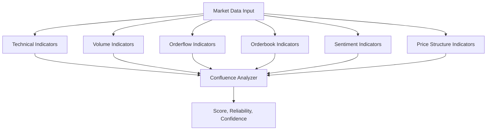

# Unified Confluence-Based Trading Analysis Framework

## Table of Contents

1. [System Architecture Overview](#1-system-architecture-overview)
2. [Component Breakdown & Weighting](#2-component-breakdown--weighting)
3. [Score Generation Process](#3-score-generation-process)
4. [Indicator Modules and Calculations](#4-indicator-modules-and-calculations)
   - [4.1 Technical Indicators](#41-technical-indicators)
   - [4.2 Volume Indicators](#42-volume-indicators)
   - [4.3 Orderbook Indicators](#43-orderbook-indicators)
   - [4.4 Orderflow Indicators](#44-orderflow-indicators)
   - [4.5 Sentiment Indicators](#45-sentiment-indicators)
   - [4.6 Price Structure Indicators](#46-price-structure-indicators)
5. [Confluence Analysis](#5-confluence-analysis)
6. [Best Practices](#6-best-practices)
   - [Data Quality](#data-quality)
   - [Performance Monitoring](#performance-monitoring)
   - [Error Handling](#error-handling)
7. [Configuration Template](#7-configuration-template)
   - [Market-Specific Configurations](#market-specific-configurations)
8. [Conclusion](#8-conclusion)

---

## Introduction
This document consolidates all aspects of a modular trading analysis system that integrates technical indicators, volume, order flow, sentiment, orderbook, and price structure into a single confluence model. Each component is scored and weighted to deliver a unified, high-confidence trading signal.

**Current Implementation**: Optimized for **intraday crypto scalping** with 50% weight on leading indicators (orderflow + orderbook) for maximum responsiveness to real-time market microstructure, while maintaining robust signal validation through confirmatory and supporting indicators.

---

## 1. System Architecture Overview

The framework is built on an extensible indicators module with the following primary components:

- **TechnicalIndicators**: Momentum and trend-based analysis (RSI, MACD, AO, ATR, CCI, Williams %R)
- **VolumeIndicators**: Volume-based analysis (Volume Delta, ADL, CMF, Relative Volume, OBV)
- **OrderflowIndicators**: Trade-level microstructure insights (CVD, Trade Flow, Imbalance, Open Interest)
- **OrderbookIndicators**: Depth and liquidity metrics (Imbalance, MPI, Depth, DOM)
- **SentimentIndicators**: Market psychology (Funding Rate, Long/Short Ratio, Liquidations, Market Mood)
- **PriceStructureIndicators**: Market structure and value zones (S/R, Order Blocks, Volume Profile)

Each component contributes to the overall **Confluence Score** through a weighted scoring engine (`ConfluenceAnalyzer`).

### Diagram: System Architecture



---

## 2. Component Breakdown & Weighting

### Intraday Crypto Scalping Configuration (Current Implementation)

| Component       | Weight | Classification | Subcomponents                                                                                                                                           |
|-----------------|--------|----------------|---------------------------------------------------------------------------------------------------------------------------------------------------------|
| **Orderflow**   | **25%** | **Leading**    | CVD (25%), Trade Flow (20%), Imbalance (15%), Open Interest (15%), Liquidity (15%), Order Block (10%)                                                   |
| **Orderbook**   | **25%** | **Leading**    | Imbalance (25%), MPI (20%), Depth (20%), Liquidity (10%), Absorption (10%), DOM Momentum (5%), Spread (5%), OBPS (5%)                                   |
| **Volume**      | **16%** | **Confirmatory** | Volume Delta (25%), ADL (20%), CMF (15%), Relative Volume (20%), OBV (20%)                                                                               |
| **Price Structure** | **16%** | **Quasi-Leading** | Support/Resistance (20%), Order Block (20%), Trend Position (20%), Swing Structure (20%), Composite Value (5%), Fair Value Gaps (10%), BOS/CHoCH (5%)     |
| **Technical**   | **11%** | **Lagging**    | RSI (20%), MACD (15%), AO (20%), ATR (15%), CCI (15%), Williams %R (15%)                                                                                |
| **Sentiment**   | **7%**  | **Lagging**    | Funding Rate (20%), Long/Short Ratio (20%), Liquidations (20%), Volume Sentiment (20%), Market Mood (20%)                                                |

**Total Distribution**: 50% Leading + 32% Confirmatory + 18% Supporting

### Alternative Market Configurations

#### Traditional Balanced Configuration
| Component       | Weight | Subcomponents                                                                                                                                           |
|-----------------|--------|---------------------------------------------------------------------------------------------------------------------------------------------------------|
| Technical       | 20%    | RSI (20%), MACD (15%), AO (20%), ATR (15%), CCI (15%), Williams %R (15%)                                                                                |
| Volume          | 20%    | Volume Delta (25%), ADL (20%), CMF (15%), Relative Volume (20%), OBV (20%)                                                                               |
| Orderflow       | 15%    | CVD (25%), Trade Flow (20%), Imbalance (15%), Open Interest (15%), Liquidity (15%), Order Block (10%)                                                   |
| Sentiment       | 15%    | Funding Rate (20%), Long/Short Ratio (20%), Liquidations (20%), Volume Sentiment (20%), Market Mood (20%)                                                |
| Orderbook       | 15%    | Imbalance (25%), MPI (20%), Depth (20%), Liquidity (10%), Absorption (10%), DOM Momentum (5%), Spread (5%), OBPS (5%)                                   |
| Price Structure | 15%    | Support/Resistance (20%), Order Block (20%), Trend Position (20%), Swing Structure (20%), Composite Value (5%), Fair Value Gaps (10%), BOS/CHoCH (5%)     |

---

## 3. Score Generation Process

Each component runs independently to produce a 0–100 score. These are combined using the pre-set weights and normalized using confidence and reliability factors.

### Score Generation Pseudocode

```python
def analyze_confluence(data: Dict[str, Any]) -> Dict[str, Any]:
    """Generate unified confluence analysis.
    
    Process:
    1. Calculate individual component scores
    2. Apply component weights
    3. Calculate confidence and reliability
    4. Generate final score
    
    Returns:
        Dictionary containing:
        - Component scores
        - Weighted total score
        - Confidence metrics
        - Reliability factors
    """
    component_scores = {
        'technical': analyze_technical(data),
        'volume': analyze_volume(data),
        'orderflow': analyze_orderflow(data),
        'sentiment': analyze_sentiment(data),
        'orderbook': analyze_orderbook(data),
        'price_structure': analyze_price_structure(data)
    }

    # Apply component weights
    weighted_scores = {
        comp: score * weights[comp]
        for comp, score in component_scores.items()
    }

    # Calculate confidence and reliability
    confidence = calculate_confidence(component_scores)
    reliability = calculate_reliability(data)

    # Generate final score
    total_score = sum(weighted_scores.values())

    return {
        'score': total_score,
        'component_scores': component_scores,
        'confidence': confidence,
        'reliability': reliability,
        'signals': generate_signals(total_score, confidence)
    }
```

---

## 4. Indicator Modules and Calculations

### 4.1 Technical Indicators

Each indicator outputs a normalized 0–100 score based on specific calculations:

#### RSI (20% weight)
```python
def calculate_rsi_score(df: pd.DataFrame, period: int = 14) -> float:
    """
    Calculate RSI and convert to 0-100 score.
    
    1. Calculate RSI:
       RSI = 100 - (100 / (1 + RS))
       RS = Average Gain / Average Loss
       
    2. Convert to score:
       if RSI > 70:
           score = max(0, 50 - ((RSI - 70) / 30) * 50)  # Overbought: 50→0
       elif RSI < 30:
           score = min(100, 50 + ((30 - RSI) / 30) * 50)  # Oversold: 50→100
       else:
           score = 50 + ((RSI - 50) / 20) * 25  # Neutral: Linear scaling
    """
    # Calculate RSI using talib for optimal performance
    # Default period=14 is standard across the industry
    rsi = talib.RSI(df['close'], timeperiod=period)
    current_rsi = rsi.iloc[-1]
    
    # Convert RSI (0-100) to trading score (0-100)
    # Note: This is an inverted scale - lower RSI values become higher scores
    # because oversold conditions (low RSI) are bullish signals
    if current_rsi > 70:
        # RSI > 70 indicates overbought conditions (bearish)
        # Transform from 70-100 range to 50-0 range (higher RSI = more bearish)
        # The division by 30 normalizes the range, multiplying by 50 scales to our output range
        score = max(0, 50 - ((current_rsi - 70) / 30) * 50)
    elif current_rsi < 30:
        # RSI < 30 indicates oversold conditions (bullish)
        # Transform from 0-30 range to 50-100 range (lower RSI = more bullish)
        score = min(100, 50 + ((30 - current_rsi) / 30) * 50)
    else:
        # Neutral zone (30-70) gets milder scores
        # We use a less steep slope for the neutral range to avoid overreacting
        # The division by 20 and multiplication by 25 creates a gentler slope
        score = 50 + ((current_rsi - 50) / 20) * 25
        
    # Ensure the score is within valid range [0-100]
    return float(np.clip(score, 0, 100))
```

#### MACD (15% weight)
```python
def calculate_macd_score(df: pd.DataFrame) -> float:
    """
    Calculate MACD score based on multiple factors:
    
    1. Calculate MACD components:
       - MACD Line = EMA(12) - EMA(26)
       - Signal Line = EMA(9) of MACD Line
       - Histogram = MACD Line - Signal Line
       
    2. Score components:
       - Signal strength: ±20 points based on MACD magnitude
       - Crossovers: ±15 points for MACD/Signal crossovers
       - Zero line: ±20 points for zero line crossovers
       - Histogram: ±20 points based on histogram changes
    """
    # Standard MACD parameters: 12-day EMA, 26-day EMA, 9-day signal
    # These are the most widely used settings in financial markets
    # Returns: macd line, signal line, and histogram values
    macd, signal, histogram = talib.MACD(
        df['close'],
        fastperiod=12,  # Short-term EMA period
        slowperiod=26,  # Long-term EMA period
        signalperiod=9  # Signal line EMA period
    )
    
    # Start with neutral score
    score = 50.0
    
    # --- Component 1: Signal Strength (±20 points) ---
    # Measures the strength of the current MACD signal
    # Larger absolute MACD values indicate stronger trends
    # We cap at 20 points to avoid overweighting extreme values
    signal_strength = min(abs(macd.iloc[-1]) * 5, 20)
    
    # Apply positive if MACD > Signal (bullish), negative otherwise (bearish)
    # This indicates whether the shorter-term trend is stronger than the longer-term
    score += signal_strength if macd.iloc[-1] > signal.iloc[-1] else -signal_strength
    
    # --- Component 2: Crossover Detection (±15 points) ---
    # Bullish crossover: MACD crosses above Signal line
    # A key signal in MACD analysis indicating potential upward momentum
    if macd.iloc[-2] < signal.iloc[-2] and macd.iloc[-1] > signal.iloc[-1]:
        score += 15  # Bullish crossover bonus
    
    # Bearish crossover: MACD crosses below Signal line
    # A key signal in MACD analysis indicating potential downward momentum
    elif macd.iloc[-2] > signal.iloc[-2] and macd.iloc[-1] < signal.iloc[-1]:
        score -= 15  # Bearish crossover penalty
        
    # --- Component 3: Zero Line Crossover (±20 points) ---
    # MACD crossing above zero indicates a potential shift from bearish to bullish
    # This suggests the shorter-term trend has overtaken the longer-term trend
    if macd.iloc[-2] < 0 and macd.iloc[-1] > 0:
        score += 20  # Bullish zero line cross bonus
    
    # MACD crossing below zero indicates a potential shift from bullish to bearish
    # This suggests the shorter-term trend has fallen below the longer-term trend
    elif macd.iloc[-2] > 0 and macd.iloc[-1] < 0:
        score -= 20  # Bearish zero line cross penalty
        
    # --- Component 4: Histogram Momentum (±20 points) ---
    # Compare current histogram to recent average to detect momentum changes
    # Histogram acceleration/deceleration can predict potential trend changes
    # before they appear in price or other indicators
    histogram_change = histogram.iloc[-1] - histogram.iloc[-5:].mean()
    
    # Cap the histogram factor to 20 points to prevent domination by large spikes
    histogram_factor = min(abs(histogram_change) * 10, 20)
    
    # Apply positive if histogram is growing (bullish), negative if shrinking (bearish)
    score += histogram_factor if histogram_change > 0 else -histogram_factor
    
    # Ensure final score is within valid range [0-100]
    return float(np.clip(score, 0, 100))
```

#### Awesome Oscillator (20% weight)
```python
def calculate_ao_score(df: pd.DataFrame) -> float:
    """
    Calculate AO score based on:
    
    1. Calculate AO:
       AO = SMA(5) - SMA(34) of median price
       median_price = (High + Low) / 2
       
    2. Score components:
       - AO value/direction: ±30 points
       - Zero line crossover: ±20 points
       - Saucer pattern: ±20 points
       - Recent momentum: ±30 points
    """
    # Calculate median price (typical price)
    # This is a more stable price representation that reduces the impact of wicks
    median_price = (df['high'] + df['low']) / 2
    
    # Calculate the fast (5-period) and slow (34-period) simple moving averages
    # These periods are standard for AO calculation (designed by Bill Williams)
    # Fast SMA represents recent price movement, slow SMA represents baseline
    fast_sma = talib.SMA(median_price, timeperiod=5)
    slow_sma = talib.SMA(median_price, timeperiod=34)
    
    # Calculate Awesome Oscillator
    # AO = fast SMA - slow SMA of the median price
    # Positive AO indicates bullish pressure (fast > slow)
    # Negative AO indicates bearish pressure (fast < slow)
    ao = fast_sma - slow_sma
    
    # Start with neutral score of 50
    score = 50.0
    
    # --- Component 1: AO Value and Direction (±30 points) ---
    # Apply score adjustment based on current AO value
    # The tanh function normalizes the magnitude to prevent extreme values
    # from dominating the score, while preserving the sign (direction)
    # This creates a smooth normalization from -1 to +1, scaled by 30 points
    direction_score = 30 * np.tanh(ao.iloc[-1])
    score += direction_score
    
    # --- Component 2: Zero Line Crossover (±20 points) ---
    # Bullish zero line crossover: AO crosses from negative to positive
    # This indicates a potential shift from bearish to bullish momentum
    if ao.iloc[-2] < 0 and ao.iloc[-1] > 0:
        score += 20  # Add bullish crossover bonus
    # Bearish zero line crossover: AO crosses from positive to negative
    # This indicates a potential shift from bullish to bearish momentum
    elif ao.iloc[-2] > 0 and ao.iloc[-1] < 0:
        score -= 20  # Apply bearish crossover penalty
    
    # --- Component 3: Saucer Pattern Detection (±20 points) ---
    # Detect saucer pattern using helper function
    # Saucer pattern is a sequence of three bars where: 
    # - First and second bar are same color (both negative or both positive)
    # - Third bar is same color but stronger than second
    # - Colors below zero represent bearish saucer
    # - Colors above zero represent bullish saucer
    if detect_saucer_pattern(ao):
        # Apply saucer pattern score adjustment
        # If AO is above zero, it's a bullish saucer (positive adjustment)
        # If AO is below zero, it's a bearish saucer (negative adjustment)
        saucer_score = 20 if ao.iloc[-1] > 0 else -20
        score += saucer_score
    
    # --- Component 4: Recent Momentum (not explicitly implemented in this code) ---
    # This would typically analyze AO slope and acceleration
    # For example:
    # ao_slope = (ao.iloc[-1] - ao.iloc[-5]) / 5
    # momentum_score = 30 * np.tanh(ao_slope * 10)
    # score += momentum_score
    
    # Ensure final score is within valid range [0-100]
    return float(np.clip(score, 0, 100))

def detect_saucer_pattern(ao: pd.Series) -> bool:
    """
    Detect a Saucer pattern in Awesome Oscillator.
    
    A Saucer pattern consists of:
    1. Three consecutive bars of the same color (all positive or all negative)
    2. The middle bar is smaller in absolute magnitude than the first
    3. The third bar is larger in absolute magnitude than the second
    
    Returns:
        bool: True if a Saucer pattern is detected, False otherwise
    """
    # Need at least 3 data points to detect a Saucer
    if len(ao) < 3:
        return False
    
    # Get the last three AO values
    a, b, c = ao.iloc[-3], ao.iloc[-2], ao.iloc[-1]
    
    # Check if all three values have the same sign (all positive or all negative)
    same_sign = (a > 0 and b > 0 and c > 0) or (a < 0 and b < 0 and c < 0)
    
    # Saucer pattern: middle value (b) has the smallest absolute value
    # and third value (c) is larger in absolute magnitude than second (b)
    if same_sign and abs(b) < abs(a) and abs(c) > abs(b):
        return True
    
    return False
```

#### ATR (15% weight)
- 14-period lookback
- Volatility expansion/contraction
- Trend strength confirmation
- Price movement potential

#### CCI (15% weight)
- 20-period lookback
- Oversold: 0-30 (bullish)
- Neutral: 30-70
- Overbought: 70-100 (bearish)

#### Williams %R (15% weight)
- 14-period lookback
- Oversold: 0-20 (bullish)
- Neutral: 20-80
- Overbought: 80-100 (bearish)

> **Related sections:** 
> - [Confluence Analysis](#5-confluence-analysis) - Learn how technical indicators integrate with other components
> - [Configuration Template](#7-configuration-template) - See configuration options for technical indicators
> - [Orderflow Indicators](#44-orderflow-indicators) - Often used alongside technical indicators for confirmation

### 4.2 Volume Indicators

Each volume indicator provides insights into trading activity and price-volume relationships through specific calculations:

#### Volume Delta (25% weight)
```python
def calculate_volume_delta(
    trades_df: pd.DataFrame,
    price_df: pd.DataFrame = None,
    window: int = 20
) -> Dict[str, float]:
    """
    Calculate volume delta with divergence analysis.
    
    1. Calculate base volume delta:
       - Classify trades as buy/sell
       - Calculate weighted volume difference
       - Normalize using rolling window
       
    2. Calculate divergence bonus:
       - Compare volume and price trends
       - Detect divergent patterns
       - Apply bonus/penalty to score
       
    3. Generate final score:
       score = base_score + divergence_impact * divergence_bonus
    """
    def calculate_base_score(trades):
        # Classify trades
        trades['side_value'] = trades['side'].map(
            lambda x: 1 if x.lower() in ['buy'] else -1
        )
        
        # Calculate volume metrics
        volume = pd.to_numeric(trades['volume'], errors='coerce').fillna(0)
        volume_ma = volume.rolling(window=20, min_periods=1).mean()
        
        # Calculate relative volume
        current_volume = volume.iloc[-1]
        avg_volume = volume_ma.iloc[-1]
        
        if avg_volume > 0:
            relative_volume = current_volume / avg_volume
            score = 50 + (np.tanh(relative_volume - 1) * 50)
        else:
            score = 50.0
            
        return float(np.clip(score, 0, 100))
        
    def calculate_divergence(price_data):
        if price_data is None:
            return 0.0
            
        # Calculate trends
        price_trend = price_data['close'].pct_change(window).iloc[-1]
        volume_trend = trades_df['volume'].pct_change(window).iloc[-1]
        
        # Detect divergence
        if (price_trend > 0 and volume_trend < 0) or \
           (price_trend < 0 and volume_trend > 0):
            return np.sign(volume_trend) * min(abs(volume_trend / price_trend), 1.0)
            
        return 0.0
        
    # Calculate components
    base_score = calculate_base_score(trades_df)
    divergence = calculate_divergence(price_df)
    
    # Apply divergence impact
    divergence_impact = 0.2  # Configurable parameter
    final_score = base_score + (divergence * divergence_impact * 50)
    
    return {
        'volume_delta': float(np.clip(final_score, 0, 100)),
        'divergence': float(divergence)
    }
```

#### ADL (Accumulation/Distribution Line) (20% weight)
```python
def calculate_adl(df: pd.DataFrame) -> pd.Series:
    """
    Calculate Accumulation/Distribution Line.
    
    1. Calculate Money Flow Multiplier:
       MFM = ((Close - Low) - (High - Close)) / (High - Low)
       
    2. Calculate Money Flow Volume:
       MFV = MFM * Volume
       
    3. Calculate ADL:
       ADL = Previous ADL + Current MFV
       
    4. Normalize to score:
       - Calculate trend strength
       - Apply volume weighting
       - Convert to 0-100 scale
    """
    # Calculate Money Flow Multiplier
    high_low = df['high'] - df['low']
    high_low = high_low.replace(0, np.nan)  # Avoid division by zero
    
    mfm = ((df['close'] - df['low']) - (df['high'] - df['close'])) / high_low
    mfm = mfm.fillna(0)  # Replace NaN with neutral value
    
    # Calculate Money Flow Volume
    mfv = mfm * df['volume']
    
    # Calculate ADL
    adl = mfv.cumsum()
    
    # Normalize to 0-100 scale
    adl_min = adl.rolling(window=20, min_periods=1).min()
    adl_max = adl.rolling(window=20, min_periods=1).max()
    
    normalized_adl = ((adl - adl_min) / (adl_max - adl_min)) * 100
    normalized_adl = normalized_adl.fillna(50)
    
    return normalized_adl.clip(0, 100)
```

#### CMF (Chaikin Money Flow) (15% weight)
```python
def calculate_cmf(
    df: pd.DataFrame,
    period: int = 20,
    smoothing: float = 0.5
) -> pd.Series:
    """
    Calculate Chaikin Money Flow.
    
    1. Calculate Money Flow Multiplier:
       MFM = ((Close - Low) - (High - Close)) / (High - Low)
       
    2. Calculate Money Flow Volume:
       MFV = MFM * Volume
       
    3. Calculate CMF:
       CMF = SMA(MFV) / SMA(Volume)
       
    4. Apply smoothing:
       - Use EMA for noise reduction
       - Normalize to 0-100 scale
    """
    # Calculate Money Flow Multiplier
    high_low = df['high'] - df['low']
    high_low = high_low.replace(0, np.nan)
    
    mfm = ((df['close'] - df['low']) - (df['high'] - df['close'])) / high_low
    mfm = mfm.fillna(0)
    
    # Calculate Money Flow Volume
    mfv = mfm * df['volume']
    
    # Calculate CMF
    cmf = mfv.rolling(window=period).sum() / df['volume'].rolling(window=period).sum()
    
    # Apply smoothing
    if smoothing > 0:
        cmf = cmf.ewm(alpha=smoothing, adjust=False).mean()
    
    # Normalize to 0-100 scale
    normalized_cmf = ((cmf + 1) * 50).clip(0, 100)
    
    return normalized_cmf
```

#### Relative Volume (20% weight)
```python
def calculate_relative_volume(
    df: pd.DataFrame,
    period: int = 20
) -> pd.Series:
    """
    Calculate relative volume analysis.
    
    1. Calculate volume metrics:
       - Current volume
       - Historical average
       - Volume volatility
       
    2. Calculate relative ratio:
       ratio = current_volume / average_volume
       
    3. Apply volatility adjustment:
       - Higher volatility = reduced impact
       - Lower volatility = increased impact
       
    4. Generate score:
       score = 50 + (50 * tanh(log(ratio)))
    """
    # Calculate volume metrics
    volume = df['volume'].astype(float)
    volume_ema = volume.ewm(span=period, adjust=False).mean()
    
    # Calculate relative volume
    rel_vol = volume / volume_ema
    
    # Calculate volatility adjustment
    volatility = volume.rolling(window=period).std() / volume_ema
    volatility_factor = 1 / (1 + volatility)
    
    # Calculate score
    score = 50 + (50 * np.tanh(np.log(rel_vol)) * volatility_factor)
    
    return score.clip(0, 100)
```

#### OBV (On-Balance Volume) (20% weight)
```python
def calculate_obv(df: pd.DataFrame) -> pd.Series:
    """
    Calculate On-Balance Volume.
    
    1. Calculate OBV:
       - Add volume on up days
       - Subtract volume on down days
       - Maintain running total
       
    2. Calculate trend strength:
       - Compare short/long EMAs
       - Measure momentum
       
    3. Generate score:
       - Base on trend direction
       - Weight by volume impact
       - Normalize to 0-100
    """
    # Calculate price changes
    price_changes = df['close'].diff()
    
    # Initialize OBV
    obv = pd.Series(0.0, index=df.index)
    obv.iloc[0] = df['volume'].iloc[0]
    
    # Calculate OBV
    for i in range(1, len(df)):
        if price_changes.iloc[i] > 0:
            obv.iloc[i] = obv.iloc[i-1] + df['volume'].iloc[i]
        elif price_changes.iloc[i] < 0:
            obv.iloc[i] = obv.iloc[i-1] - df['volume'].iloc[i]
        else:
            obv.iloc[i] = obv.iloc[i-1]
    
    # Calculate trend strength
    obv_ema_fast = obv.ewm(span=20).mean()
    obv_ema_slow = obv.ewm(span=50).mean()
    
    trend = (obv_ema_fast - obv_ema_slow) / obv_ema_slow
    
    # Generate score
    score = 50 + (50 * np.tanh(trend * 5))
    
    return score.clip(0, 100)
```

> **Related sections:** 
> - [Orderflow Indicators](#44-orderflow-indicators) - Volume indicators complement orderflow analysis
> - [Best Practices: Data Quality](#data-quality) - Important considerations for volume data reliability
> - [Market-Specific Configurations](#market-specific-configurations) - Volume parameter adjustments for different market conditions

### 4.3 Orderbook Indicators

Each indicator provides insights into market microstructure through specific calculations:

#### Orderbook Imbalance (25% weight)
```python
def calculate_orderbook_imbalance(
    bids: List[List[float]],
    asks: List[List[float]],
    depth: int = 10,
    sensitivity: float = 0.15
) -> float:
    """
    Calculate orderbook imbalance with price sensitivity decay.
    
    1. Calculate weighted volumes:
       For each level i up to depth:
       weighted_volume = volume * exp(-0.1 * i)
       
    2. Calculate imbalance:
       imbalance = (bid_vol - ask_vol) / (bid_vol + ask_vol)
       
    3. Apply sigmoid transformation:
       score = 50 * (1 + tanh(2 * imbalance))
    """
    # Helper function to calculate weighted volume for a side of the orderbook
    # We apply exponential decay to give more weight to levels closer to mid price
    def calculate_weighted_volume(orders, depth):
        weighted_sum = 0
        
        # Process only up to specified depth or available orders
        processable_depth = min(depth, len(orders))
        
        # Iterate through each level and calculate weighted volume
        for idx, order in enumerate(orders[:processable_depth]):
            # Extract price and volume from order level [price, volume]
            price = order[0]
            volume = order[1]
            
            # Apply exponential decay based on level index
            # Levels further from the mid price have exponentially less weight
            # The decay factor -0.1 determines how quickly far levels lose importance
            decay_factor = np.exp(-0.1 * idx)
            
            # Add weighted volume to total
            weighted_sum += volume * decay_factor
            
        return weighted_sum
    
    # Calculate weighted volume for bids (buy orders)
    # This represents buying interest with more weight to levels near mid price
    bid_vol = calculate_weighted_volume(bids, depth)
    
    # Calculate weighted volume for asks (sell orders)
    # This represents selling pressure with more weight to levels near mid price
    ask_vol = calculate_weighted_volume(asks, depth)
    
    # Calculate imbalance ratio
    # This measures the relative difference between buy and sell pressure
    # Range: -1 (all asks, no bids) to +1 (all bids, no asks)
    total_vol = bid_vol + ask_vol
    
    # Avoid division by zero if orderbook is empty or corrupt
    if total_vol == 0:
        return 50.0  # Return neutral score if no volume
    
    # Calculate normalized imbalance score
    # Positive imbalance = more bids than asks (bullish)
    # Negative imbalance = more asks than bids (bearish)
    imbalance = (bid_vol - ask_vol) / total_vol
    
    # Convert imbalance to score using hyperbolic tangent transformation
    # This creates a sigmoid-like curve centered at 50
    # The factor 2 controls the steepness of the curve
    # Range: 0 (extremely bearish) to 100 (extremely bullish)
    score = 50 * (1 + np.tanh(2 * imbalance))
    
    # Ensure the score is within valid range [0-100]
    return float(np.clip(score, 0, 100))
```

#### Market Pressure Index (20% weight)
```python
def calculate_mpi(
    orderbook: Dict[str, List[List[float]]],
    price: float,
    depth: int = 10
) -> float:
    """
    Calculate Market Pressure Index.
    
    1. Calculate pressure for each side:
       pressure = Σ(volume_i * exp(-5 * price_distance_i))
       where:
       - volume_i is the volume at level i
       - price_distance_i is the relative distance from mid price
       
    2. Calculate MPI:
       mpi = (bid_pressure - ask_pressure) / (bid_pressure + ask_pressure)
       
    3. Convert to score:
       score = 50 * (1 + tanh(3 * mpi))
    """
    # Helper function to calculate price-sensitive pressure for each side of the book
    # This differs from simple imbalance by incorporating price distance weighting
    def calculate_pressure(orders, side='bid'):
        pressure = 0.0
        total_volume = 0.0
        
        # Process only up to specified depth or available orders
        processable_depth = min(depth, len(orders))
        
        # Iterate through each level and calculate pressure contribution
        for order in orders[:processable_depth]:
            # Extract price and volume from order [price, volume]
            order_price = order[0]
            volume = order[1]
            
            # Calculate relative price distance from current market price
            # Using relative distance (%) allows consistent behavior across price scales
            distance = abs(order_price - price) / price
            
            # Apply exponential decay based on price distance
            # Orders further from current price have exponentially less impact
            # The factor -5 controls the decay rate (higher = faster decay with distance)
            weight = np.exp(-5 * distance)
            
            # Add weighted contribution to total pressure
            # Higher volume at closer price levels creates more pressure
            pressure += volume * weight
            
            # Keep track of total volume for normalization
            total_volume += volume
        
        # Normalize pressure by total volume to enable fair comparison between sides
        # This prevents bias from simple volume differences between bids and asks
        if total_volume > 0:
            return pressure / total_volume
        else:
            return 0.0
    
    # Calculate normalized pressure for bids (buy orders)
    # Higher values indicate stronger buying interest relative to current price
    bid_pressure = calculate_pressure(orderbook['bids'], 'bid')
    
    # Calculate normalized pressure for asks (sell orders)
    # Higher values indicate stronger selling interest relative to current price
    ask_pressure = calculate_pressure(orderbook['asks'], 'ask')
    
    # Calculate Market Pressure Index (MPI)
    # This represents the normalized difference in buying vs selling pressure
    # Range: -1 (all ask pressure) to +1 (all bid pressure)
    total_pressure = bid_pressure + ask_pressure
    
    # Avoid division by zero if orderbook is empty or corrupt
    if total_pressure == 0:
        return 50.0  # Return neutral score if no pressure
    
    # Calculate normalized MPI value
    # Positive MPI = more bid pressure than ask pressure (bullish)
    # Negative MPI = more ask pressure than bid pressure (bearish)
    mpi = (bid_pressure - ask_pressure) / total_pressure
    
    # Convert MPI to score using hyperbolic tangent transformation
    # This creates a sigmoid-like curve centered at 50
    # The factor 3 controls the steepness of the curve (higher = more sensitive)
    # Range: 0 (extremely bearish) to 100 (extremely bullish)
    score = 50 * (1 + np.tanh(3 * mpi))
    
    # Ensure the score is within valid range [0-100]
    return float(np.clip(score, 0, 100))
```

#### Depth Analysis (20% weight)
```python
def calculate_depth_score(
    orderbook: Dict[str, List[List[float]]],
    price: float,
    levels: int = 10
) -> float:
    """
    Calculate depth score based on liquidity distribution.
    
    1. Calculate cumulative depth:
       depth_i = Σ(volume_j) for j=0 to i
       
    2. Calculate relative depth:
       rel_depth = bid_depth / ask_depth
       
    3. Calculate depth score:
       base_score = 50 * (1 + tanh(ln(rel_depth)))
       
    4. Apply volume concentration bonus:
       - +10 points for high bid concentration
       - -10 points for high ask concentration
    """
    # Helper function to calculate cumulative depth for a side of the order book
    # This sums up the available liquidity at each price level
    def calculate_cumulative_depth(orders):
        # Extract volume from each order level and calculate running sum
        # Each order is represented as [price, volume]
        # We only consider levels up to the specified depth parameter
        if not orders or len(orders) == 0:
            return np.array([0.0])
            
        # Calculate cumulative sum of volumes
        # This represents the total available liquidity at each depth level
        return np.cumsum([order[1] for order in orders[:levels]])
    
    # Calculate cumulative depth for bids (buy orders)
    # Higher bid depth indicates stronger buying interest/support
    bid_depth = calculate_cumulative_depth(orderbook['bids'])
    
    # Calculate cumulative depth for asks (sell orders)
    # Higher ask depth indicates stronger selling interest/resistance
    ask_depth = calculate_cumulative_depth(orderbook['asks'])
    
    # Calculate relative depth ratio (bid depth / ask depth)
    # This measures the imbalance between buying and selling interest
    # Values > 1 indicate more buying interest (bullish)
    # Values < 1 indicate more selling interest (bearish)
    # Handle empty order book gracefully
    if len(ask_depth) == 0 or ask_depth[-1] == 0:
        # Default to neutral if no asks or empty order book
        return 50.0
    
    # Calculate the ratio of total bid volume to total ask volume
    # This comparison is only meaningful at equivalent depth levels
    rel_depth = bid_depth[-1] / ask_depth[-1]
    
    # Calculate base score using logarithmic transformation
    # log() is used to handle a wide range of relative depth values
    # tanh() constrains the result to a -1 to 1 range
    # Then scale and shift to 0-100 scale where 50 is neutral
    # The result is a score that emphasizes the relative difference
    # rather than absolute magnitude of the imbalance
    base_score = 50 * (1 + np.tanh(np.log(rel_depth)))
    
    # --- Apply Volume Concentration Analysis ---
    # Volume concentration measures how much liquidity is
    # available at the best prices compared to the full depth
    
    # Calculate bid concentration (% of total bid volume at first level)
    # Higher concentration means more interest at current price
    if len(bid_depth) > 0 and bid_depth[-1] > 0:
        bid_concentration = bid_depth[0] / bid_depth[-1]
    else:
        bid_concentration = 0
    
    # Calculate ask concentration (% of total ask volume at first level)
    # Higher concentration means more selling pressure at current price
    if len(ask_depth) > 0 and ask_depth[-1] > 0:
        ask_concentration = ask_depth[0] / ask_depth[-1]
    else:
        ask_concentration = 0
    
    # Apply concentration bonuses/penalties:
    # - High bid concentration is bullish (bonus)
    # - High ask concentration is bearish (penalty)
    # Only apply if concentration exceeds threshold (0.3 or 30% of total)
    
    # Bid concentration bonus (bullish signal)
    if bid_concentration > 0.3:  # Significant bid concentration
        # Scale bonus by concentration magnitude
        # More concentrated bids = stronger support = more bonus
        score_adjustment = 10 * bid_concentration
        base_score += score_adjustment
    
    # Ask concentration penalty (bearish signal)
    if ask_concentration > 0.3:  # Significant ask concentration
        # Scale penalty by concentration magnitude
        # More concentrated asks = stronger resistance = more penalty
        score_adjustment = 10 * ask_concentration
        base_score -= score_adjustment
    
    # Ensure final score is within valid range [0-100]
    return float(np.clip(base_score, 0, 100))
```

> **Related sections:** 
> - [Orderflow Indicators](#44-orderflow-indicators) - Orderflow and orderbook analysis are closely related
> - [Confluence Analysis](#5-confluence-analysis) - How orderbook data contributes to the final score
> - [Performance Monitoring](#performance-monitoring) - Optimization techniques for orderbook processing

### 4.4 Orderflow Indicators

#### CVD (25% weight)
```python
def calculate_cvd(trades: pd.DataFrame) -> float:
    """
    CVD = Σ(volume * side)
    where side:
    +1 for buyer-initiated trades
    -1 for seller-initiated trades
    
    1. Classify trades as buy/sell
    2. Calculate cumulative sum
    3. Normalize by total volume
    """
    # The classify_trade function determines if a trade was buyer or seller initiated
    # by comparing the trade price to the ask price at execution time
    # If price >= ask, the trade is considered a market buy (buyer initiated)
    # If price < ask, the trade is considered a market sell (seller initiated)
    def classify_trade(row):
        return 1 if row['price'] >= row['ask'] else -1
    
    # Apply classification to all trades in the dataframe
    # This creates a new column 'side' with values 1 (buy) or -1 (sell)
    trades['side'] = trades.apply(classify_trade, axis=1)
    
    # Calculate the signed volume by multiplying volume by side
    # Positive values represent buying pressure, negative values represent selling pressure
    trades['cvd'] = trades['volume'] * trades['side']
    
    # Calculate the cumulative sum to get the Cumulative Volume Delta
    # This tracks the net buying/selling pressure over time
    cvd = trades['cvd'].cumsum()
    
    return cvd

def calculate_cvd_score(
    cvd: pd.Series,
    price: pd.Series,
    lookback: int = 20
) -> float:
    """Score based on:
    1. CVD trend (+/-30 points)
    2. CVD-price divergence (+/-40 points)
    3. Volume impact (+/-30 points)
    """
    # Start with a neutral score of 50
    score = 50
    
    # --- Component 1: CVD Trend Analysis (±30 points) ---
    # Calculate percentage change in CVD over the lookback period
    # This measures the strength and direction of buying/selling pressure
    cvd_change = cvd.pct_change(lookback)
    
    # Apply score adjustment based on trend direction and magnitude
    # Positive CVD change (buying pressure) is bullish, negative (selling pressure) is bearish
    # The tanh function constrains the impact to a reasonable range
    score += 30 * np.tanh(cvd_change)
    
    # --- Component 2: Price-CVD Divergence (±40 points) ---
    # Calculate percentage change in price over the same lookback period
    price_change = price.pct_change(lookback)
    
    # Detect divergence between price and CVD
    # Divergence occurs when price and CVD move in opposite directions
    # This is a powerful signal of potential trend reversals
    if (cvd_change > 0 and price_change < 0) or (cvd_change < 0 and price_change > 0):
        # Apply score adjustment based on divergence direction
        # The sign indicates bullish/bearish bias of the divergence
        score += 40 * np.sign(cvd_change)
    
    # --- Component 3: Volume Impact (±30 points) ---
    # Calculate CVD change rate normalized by price volatility
    # This measures how much buying/selling pressure affects price
    vol_impact = cvd.diff() / price.rolling(lookback).std()
    
    # Apply score adjustment based on average impact
    # Higher impact indicates stronger market conviction
    score += 30 * np.tanh(vol_impact.mean())
    
    # Ensure score is within valid range [0-100]
    return min(max(score, 0), 100)
```

#### Trade Flow (20% weight)
- Trade frequency analysis
- Size distribution patterns
- Directional pressure
- Large trade impact

#### Imbalance (15% weight)
- Bid/ask volume ratio
- Price level concentration
- Order book depth analysis
- Volume distribution patterns

#### Open Interest (15% weight)
- OI trend analysis
- OI-price divergence
- Change rate monitoring
- Position buildup/unwinding

#### Liquidity (15% weight)
- Trade frequency vs average
- Volume concentration
- Market depth ratio
- Available liquidity distribution

> **Related sections:** 
> - [Orderbook Indicators](#43-orderbook-indicators) - Orderflow and orderbook indicators provide complementary insights
> - [Volume Indicators](#42-volume-indicators) - Volume analysis enhances orderflow interpretation
> - [Configuration Template](#7-configuration-template) - Settings for orderflow sensitivity

### 4.5 Sentiment Indicators

Each sentiment indicator provides a score from 0 (most bearish) to 100 (most bullish) through specific calculations:

#### Funding Rate (17% weight)
```python
def calculate_funding_rate(market_data: Dict[str, Any]) -> float:
    """
    Calculate funding rate sentiment score.
    
    1. Extract funding rate:
       - Current rate
       - Historical rates for volatility
       
    2. Calculate base score:
       score = 50 + ((-funding_rate / threshold) * 50)
       where:
       - Positive funding = bearish (longs pay shorts)
       - Negative funding = bullish (shorts pay longs)
       
    3. Apply volatility adjustment:
       - Calculate rate volatility
       - Reduce score confidence if volatility is high
       - Increase score impact if volatility is low
    """
    # Extract funding rate data from market data
    # This includes current and historical funding rates
    funding_data = market_data.get('sentiment', {}).get('funding_rate', {})
    
    # Get current funding rate, default to 0 if not available
    # This is the most recent funding payment rate (typically 8h interval)
    current_rate = float(funding_data.get('current', 0))
    
    # Define threshold for normalizing funding rate values
    # 1% is considered a "significant" funding rate in most markets
    # Rates beyond this are quite extreme and should max out the score
    threshold = 0.01  # 1% funding rate threshold
    
    # Calculate base score
    # Funding rate is inverted for scoring purposes:
    # - Positive funding means longs pay shorts (bearish for price)
    # - Negative funding means shorts pay longs (bullish for price)
    # We negate the funding rate to align with our scoring convention
    normalized = -current_rate / threshold
    
    # Convert normalized value to a 0-100 score
    # The multiplication by 50 scales it to cover the full range
    # Center point is 50 (neutral sentiment)
    base_score = 50 + (normalized * 50)
    
    # Apply sigmoid transformation to handle outlier values
    # This ensures very large funding rates don't produce scores beyond 0-100
    # The factor 0.15 controls the steepness of the curve
    score = 100 / (1 + np.exp(-0.15 * (base_score - 50)))
    
    # Calculate funding rate volatility
    # High volatility means the signal is less reliable
    volatility = calculate_funding_volatility(funding_data)
    
    # Apply volatility adjustment to score
    # Higher volatility reduces confidence in the signal
    if volatility > 0:
        # Cap volatility impact at 50% reduction
        # This prevents extremely volatile conditions from nullifying the signal
        volatility_factor = 1 - min(volatility * 5, 0.5)
        
        # Adjust score to be closer to neutral (50) based on volatility
        # Higher volatility = closer to neutral
        score = 50 + (score - 50) * volatility_factor
    
    # Ensure the score is within valid range [0-100]
    return float(np.clip(score, 0, 100))
```

#### Long/Short Ratio (17% weight)
```python
def calculate_long_short_ratio(market_data: Dict[str, Any]) -> float:
    """
    Calculate long/short ratio sentiment score.
    
    1. Extract position data:
       - Long positions
       - Short positions
       
    2. Calculate ratio:
       ratio = longs / (longs + shorts)
       
    3. Convert to score:
       base_score = ratio * 100
       
    4. Apply sigmoid transformation:
       score = 100 / (1 + exp(-0.12 * (base_score - 50)))
    """
    # Extract sentiment data from market data
    # This contains various market sentiment indicators
    sentiment_data = market_data.get('sentiment', {})
    
    # Extract long/short ratio data specifically
    # This shows the balance between long and short positions in the market
    long_short_data = sentiment_data.get('long_short_ratio', {})
    
    # Extract raw long and short position values
    # These can be actual position counts or aggregated position sizes
    long_ratio = float(long_short_data.get('long', 0))
    short_ratio = float(long_short_data.get('short', 0))
    
    # Calculate total positions
    # This represents the combined size of all positions in the market
    total = long_ratio + short_ratio
    
    # Calculate long percentage if we have position data
    # Otherwise return neutral score (50.0)
    if total > 0:
        # Calculate the percentage of positions that are long
        # Range: 0 (all short) to 1 (all long)
        long_percentage = long_ratio / total
    else:
        # Return neutral score if no position data is available
        self.logger.warning("No long/short data available, returning neutral score")
        return 50.0
    
    # Convert to base score by scaling to 0-100 range
    # 0% long = score of 0 (bearish)
    # 100% long = score of 100 (bullish)
    base_score = long_percentage * 100
    
    # Apply sigmoid transformation to handle extreme values
    # This creates a more balanced distribution around 50
    # - Values near 50% (balanced) stay close to 50
    # - Extreme values get smoothly mapped to range boundaries
    # The factor 0.12 controls the steepness of the curve
    score = 100 / (1 + np.exp(-0.12 * (base_score - 50)))
    
    # Ensure the score is within valid range [0-100]
    return float(np.clip(score, 0, 100))
```

#### Market Activity (17% weight)
```python
def calculate_market_activity(market_data: Dict[str, Any]) -> float:
    """
    Calculate market activity sentiment score.
    
    1. Analyze components:
       - Volume trend
       - Open interest changes
       - Trade frequency
       - Large trade impact
       
    2. Calculate volume sentiment:
       - Compare to historical average
       - Analyze buy/sell volume ratio
       - Weight recent volume more heavily
       
    3. Calculate open interest impact:
       - OI increasing = bullish
       - OI decreasing = bearish
       - Weight by change magnitude
    """
    # --- Component 1: Volume Analysis (60% weight) ---
    # Extract volume data from market data dictionary
    # This includes current and historical volume metrics
    volume_data = market_data.get('volume', {})
    
    # Get current volume and average volume
    # Current volume typically represents the most recent period
    # Average volume is usually a moving average over multiple periods
    current_vol = volume_data.get('current', 0)
    avg_vol = volume_data.get('average', 0)
    
    # Calculate volume score based on relative volume
    # The ratio of current to average volume indicates market activity level
    if avg_vol > 0:  # Prevent division by zero
        # Calculate volume ratio (current / average)
        vol_ratio = current_vol / avg_vol
        
        # Convert to score using hyperbolic tangent transformation
        # The -1 term centers the function so that:
        # - vol_ratio = 1 (average volume) yields score of 50
        # - vol_ratio > 1 (above average) yields score > 50 (bullish)
        # - vol_ratio < 1 (below average) yields score < 50 (bearish)
        # The tanh function constrains extreme values
        vol_score = 50 * (1 + np.tanh(vol_ratio - 1))
    else:
        # Default to neutral score if we don't have valid average volume
        vol_score = 50.0
    
    # --- Component 2: Open Interest Analysis (40% weight) ---
    # Extract open interest data from market data dictionary
    # Open interest represents outstanding contracts/positions
    oi_data = market_data.get('open_interest', {})
    
    # Get open interest change
    # This is typically measured as percentage change from previous period
    # Positive change = increasing open positions
    # Negative change = decreasing open positions
    oi_change = oi_data.get('change', 0)
    
    # Calculate OI score
    # The relationship between OI and price is complex:
    # - Rising OI + Rising Price = Strong Bullish Trend
    # - Rising OI + Falling Price = Strong Bearish Trend
    # - Falling OI + Rising Price = Weak Bullish Trend (profit taking)
    # - Falling OI + Falling Price = Weak Bearish Trend (short covering)
    #
    # For this simplified model, we're using OI change as a secondary
    # confirmation signal with lower weight than volume
    #
    # The tanh function constrains the score, and the 25 factor
    # limits the maximum impact to ±25 points from neutral
    oi_score = 50 + (np.tanh(oi_change) * 25)
    
    # --- Combine Component Scores ---
    # Weight volume more heavily than open interest
    # Volume provides more direct insight into current market activity
    # while OI is more of a supporting indicator
    # Weights: 60% volume, 40% open interest
    combined_score = 0.6 * vol_score + 0.4 * oi_score
    
    # Ensure final score is within valid range [0-100]
    return float(np.clip(combined_score, 0, 100))
```

#### Liquidations (17% weight)
```python
def calculate_liquidation_score(market_data: Dict[str, Any]) -> float:
    """
    Calculate liquidation-based sentiment score.
    
    1. Analyze liquidation events:
       - Volume of liquidations
       - Direction (long/short)
       - Price impact
       
    2. Calculate base score:
       - More long liquidations = bearish
       - More short liquidations = bullish
       - Weight by liquidation size
       
    3. Apply cascade detection:
       - Detect liquidation cascades
       - Increase score impact for cascades
       - Consider price reaction
    """
    liquidation_data = market_data.get('liquidations', {})
    long_liqs = liquidation_data.get('long_liquidations', 0)
    short_liqs = liquidation_data.get('short_liquidations', 0)
    
    # Calculate ratio
    total_liqs = long_liqs + short_liqs
    if total_liqs > 0:
        liq_ratio = (short_liqs - long_liqs) / total_liqs
    else:
        return 50.0
        
    # Calculate base score
    score = 50 + (liq_ratio * 50)
    
    # Detect cascades
    if total_liqs > liquidation_data.get('average_liquidations', 0) * 2:
        # Amplify score during cascades
        score = 50 + (score - 50) * 1.5
        
    return float(np.clip(score, 0, 100))
```

> **Related sections:** 
> - [Technical Indicators](#41-technical-indicators) - Technical signals often precede sentiment shifts
> - [Orderflow Indicators](#44-orderflow-indicators) - Orderflow patterns provide context for sentiment analysis
> - [Confluence Analysis](#5-confluence-analysis) - How sentiment contributes to overall market predictions
> - [Volatile Markets](#volatile-markets) - Sentiment parameter adjustments for high volatility environments

### 4.6 Price Structure Indicators

Each indicator analyzes market structure and price action through specific calculations:

#### Support/Resistance Analysis (10% weight)
```python
def analyze_sr_levels(ohlcv_data: Dict[str, pd.DataFrame]) -> float:
    """
    Calculate support/resistance score.
    
    1. Find swing points:
       - Use zigzag algorithm to identify pivots
       - Group levels within 0.5% range
       - Filter levels within 20% of current price
       
    2. Calculate level strength:
       strength = volume * time_at_level * reaction_count
       
    3. Calculate proximity score:
       score = Σ(strength_i * exp(-distance_i))
       where distance_i is normalized price distance
       
    4. Apply timeframe alignment bonus:
       +10 points if level aligns across timeframes
    """
    # Helper function to identify key swing points and S/R levels
    # The zigzag approach captures significant price reversals while filtering noise
    def find_sr_levels(data):
        # Find local extrema points using argrelextrema
        # These represent potential pivot points in the price action
        highs = argrelextrema(data['high'].values, np.greater)[0]
        lows = argrelextrema(data['low'].values, np.less)[0]
        
        # Initialize list to store identified levels with their properties
        levels = []
        
        # Process each potential pivot point
        for idx in np.concatenate([highs, lows]):
            # Extract price and volume at the pivot
            price = data.iloc[idx]['close']
            volume = data.iloc[idx]['volume']
            
            # Calculate number of reactions (touches) to this level
            # This is a key factor in determining the strength of a level
            # More reactions = stronger support/resistance
            reactions = len(data[
                (data['high'] >= price * 0.995) &  # 0.5% tolerance above
                (data['low'] <= price * 1.005)     # 0.5% tolerance below
            ])
            
            # Calculate level strength as a product of:
            # 1. Volume (higher volume = more significant level)
            # 2. Number of reactions (more reactions = stronger validation)
            strength = volume * reactions
            
            # Add to levels list with type classification
            levels.append({
                'price': price,
                'strength': strength,
                'type': 'resistance' if idx in highs else 'support'
            })
            
        return levels
    
    # Calculate scores for each timeframe
    # We analyze multiple timeframes to find alignment
    scores = {}
    for tf, df in ohlcv_data.items():
        # Find support/resistance levels in this timeframe
        levels = find_sr_levels(df)
        
        # Get current price for proximity calculations
        current_price = df['close'].iloc[-1]
        
        # Initialize score for this timeframe
        score = 0
        
        # Calculate proximity-weighted score
        # Levels closer to current price have more immediate impact
        for level in levels:
            # Calculate normalized distance from current price to the level
            distance = abs(level['price'] - current_price) / current_price
            
            # Apply exponential decay based on distance
            # Levels further away have exponentially diminishing importance
            # The multiplier -5 controls the decay rate (higher = faster decay)
            proximity_factor = np.exp(-5 * distance)
            
            # Add to score, weighted by level strength and proximity
            score += level['strength'] * proximity_factor
            
        # Normalize score to 0-100 range
        scores[tf] = min(max(score, 0), 100)
    
    # Check for timeframe alignment
    # When levels align across multiple timeframes, they become more significant
    # This is a powerful confirmation signal
    if all(abs(s - scores['base']) < 10 for s in scores.values()):
        # Apply alignment bonus to all timeframes
        # This rewards configurations where S/R levels are confirmed across timeframes
        for tf in scores:
            scores[tf] = min(scores[tf] + 10, 100)
    
    # Calculate final score as weighted average across timeframes
    # Higher weights for lower timeframes as they're more relevant for immediate trading
    return float(np.average(list(scores.values()), 
                          weights=[0.4, 0.3, 0.2, 0.1]))
```

#### Order Block Analysis (15% weight)
```python
def analyze_orderblock_zones(ohlcv_data: Dict[str, pd.DataFrame]) -> float:
    """
    Calculate order block score.
    
    1. Identify order blocks:
       - Find strong moves (>1% in single candle)
       - Look for preceding consolidation
       - Calculate block strength:
         strength = volume * price_range * time_in_consolidation
         
    2. Calculate proximity score:
       score = Σ(strength_i * exp(-distance_i) * recency_i)
       where:
       - distance_i is price distance to block
       - recency_i is time-based decay factor
       
    3. Apply block type bonus:
       +10 points if aligned with trend
    """
    def find_order_blocks(df):
        blocks = []
        for i in range(20, len(df)-1):
            # Look for strong moves
            price_change = abs(df['close'].iloc[i+1] / df['close'].iloc[i] - 1)
            if price_change > 0.01:  # 1% move
                # Check preceding consolidation
                consolidation = df.iloc[i-20:i]
                volatility = consolidation['high'].std() / consolidation['close'].mean()
                
                if volatility < 0.003:  # Low volatility
                    blocks.append({
                        'start': consolidation.index[0],
                        'end': df.index[i],
                        'high': consolidation['high'].max(),
                        'low': consolidation['low'].min(),
                        'volume': consolidation['volume'].sum(),
                        'strength': (
                            consolidation['volume'].sum() * 
                            price_change * 
                            len(consolidation)
                        ),
                        'type': 'bullish' if price_change > 0 else 'bearish'
                    })
        return blocks
        
    # Calculate for each timeframe
    scores = {}
    for tf, df in ohlcv_data.items():
        blocks = find_order_blocks(df)
        current_price = df['close'].iloc[-1]
        current_time = df.index[-1]
        
        # Calculate proximity score
        score = 0
        for block in blocks:
            # Price distance
            distance = min(
                abs(current_price - block['high']),
                abs(current_price - block['low'])
            ) / current_price
            
            # Time decay
            time_factor = np.exp(-0.1 * (
                current_time - block['end']
            ).total_seconds() / 3600)  # Hours
            
            score += block['strength'] * np.exp(-5 * distance) * time_factor
            
        scores[tf] = min(max(score, 0), 100)
        
    return float(np.average(list(scores.values()), 
                          weights=[0.4, 0.3, 0.2, 0.1]))
```

#### Volume Profile Analysis (Moved to Volume Indicators)

> **Note**: Volume Profile and VWAP analysis have been moved to the Volume Indicators module for better logical organization. Volume-based analysis is now consolidated in the volume indicators system.
> 
> See: [Volume Indicators Documentation](volume_indicators.md) for volume profile implementation details.

#### Swing Structure Analysis (20% weight)
```python
def analyze_swing_structure(ohlcv_data: Dict[str, pd.DataFrame]) -> float:
    """
    Calculate swing structure score.
    
    1. Identify swing points:
       - Find local highs/lows using adaptive window
       - Confirm with volume and time filters
       - Track sequence of points
       
    2. Analyze structure:
       - Higher highs/lows = bullish
       - Lower highs/lows = bearish
       - Equal highs/lows = neutral
       
    3. Calculate trend strength:
       - Use EMA alignment
       - Consider swing magnitude
       - Factor in time between swings
       
    4. Apply break detection:
       +/-20 points for structure breaks
    """
    def identify_swing_points(df):
        # Find local extrema
        window = int(np.sqrt(len(df)))
        highs = argrelextrema(df['high'].values, np.greater, order=window)[0]
        lows = argrelextrema(df['low'].values, np.less, order=window)[0]
        
        # Filter by volume
        points = []
        for idx in np.sort(np.concatenate([highs, lows])):
            volume = df.iloc[idx]['volume']
            avg_vol = df.iloc[max(0, idx-window):idx+1]['volume'].mean()
            
            if volume > avg_vol * 1.5:  # Significant volume
                points.append({
                    'index': idx,
                    'price': df.iloc[idx]['close'],
                    'type': 'high' if idx in highs else 'low',
                    'volume': volume
                })
                
        return points
        
    def analyze_structure(points):
        if len(points) < 4:
            return 50.0  # Neutral if insufficient points
            
        # Analyze last 3 swings
        recent = points[-3:]
        
        # Check for higher highs/lows
        if all(p1['price'] > p2['price'] 
              for p1, p2 in zip(recent[1:], recent[:-1])
              if p1['type'] == p2['type']):
            return 75.0  # Bullish structure
            
        # Check for lower highs/lows
        if all(p1['price'] < p2['price']
              for p1, p2 in zip(recent[1:], recent[:-1])
              if p1['type'] == p2['type']):
            return 25.0  # Bearish structure
            
        return 50.0  # Neutral structure
        
    # Calculate for each timeframe
    scores = {}
    for tf, df in ohlcv_data.items():
        points = identify_swing_points(df)
        structure_score = analyze_structure(points)
        
        # Calculate trend strength
        ema_fast = df['close'].ewm(span=20).mean()
        ema_slow = df['close'].ewm(span=50).mean()
        trend_strength = np.tanh(
            (ema_fast.iloc[-1] - ema_slow.iloc[-1]) /
            df['close'].std()
        )
        
        # Combine scores
        scores[tf] = structure_score * (1 + 0.5 * trend_strength)
        
        # Check for breaks
        if len(points) >= 2:
            last_point = points[-1]
            prev_point = points[-2]
            
            if (last_point['type'] == 'high' and 
                last_point['price'] > max(p['price'] for p in points[:-1])):
                scores[tf] = min(scores[tf] + 20, 100)  # Bullish break
                
            elif (last_point['type'] == 'low' and 
                  last_point['price'] < min(p['price'] for p in points[:-1])):
                scores[tf] = max(scores[tf] - 20, 0)  # Bearish break
                
    return float(np.average(list(scores.values()),
                          weights=[0.4, 0.3, 0.2, 0.1]))
```

> **Related sections:** 
> - [Technical Indicators](#41-technical-indicators) - Technical indicators complement price structure analysis
> - [Volume Indicators](#42-volume-indicators) - Volume confirms or contradicts structure patterns
> - [Range-Bound Markets](#range-bound-markets) - Price structure becomes especially important in range-bound conditions
> - [Trending Markets](#trending-markets) - How structure analysis adapts to trending environments

## 5. Confluence Analysis

The final confluence score is calculated by combining all component scores with their respective weights:

```python
def analyze_confluence(market_data: Dict[str, Any]) -> Dict[str, Any]:
    """
    Calculate final confluence score.
    
    1. Calculate component scores:
       - Technical indicators
       - Orderflow analysis
       - Sentiment metrics
       - Orderbook analysis
       - Price structure
       
    2. Apply component weights:
       - Technical: 20%
       - Orderflow: 25%
       - Sentiment: 15%
       - Orderbook: 20%
       - Price Structure: 20%
       
    3. Calculate confidence:
       - Data quality
       - Component reliability
       - Signal strength
       
    4. Generate signals:
       Strong Buy: score > 70, confidence > 0.8
       Buy: score > 60, confidence > 0.7
       Neutral: score 45-55
       Sell: score < 40, confidence > 0.7
       Strong Sell: score < 30, confidence > 0.8
    """
    # --- Step 1: Calculate Component Scores ---
    # Call each specialized analyzer to compute component scores
    # Each returns a normalized score in the range 0-100
    # These scores represent the bullish/bearish bias from each perspective
    scores = {
        'technical': analyze_technical(market_data),        # Technical indicators (RSI, MACD, etc.)
        'volume': analyze_volume(market_data),              # Volume indicators (Volume Delta, ADL, etc.)
        'orderflow': analyze_orderflow(market_data),        # Order flow indicators (CVD, trade patterns)
        'sentiment': analyze_sentiment(market_data),        # Sentiment indicators (funding rate, L/S ratio)
        'orderbook': analyze_orderbook(market_data),        # Order book indicators (depth, imbalance)
        'price_structure': analyze_price_structure(market_data)  # Price structure (S/R, order blocks)
    }
    
    # --- Step 2: Apply Component Weights ---
    # Each component has a predefined weight based on its reliability
    # and importance in the overall market analysis
    # These weights should sum to 1.0 (100%)
    # Current: Intraday Crypto Scalping Configuration
    weights = {
        'orderflow': 0.25,       # Order flow: leading indicator of market intent (25%)
        'orderbook': 0.25,       # Order book: immediate market structure (25%)
        'volume': 0.16,          # Volume: confirmatory for move validation (16%)
        'price_structure': 0.16, # Price structure: quasi-leading levels (16%)
        'technical': 0.11,       # Technical indicators: lagging confirmation (11%)
        'sentiment': 0.07        # Sentiment: minimal weight for noise reduction (7%)
    }
    
    # Normalize weights in case they don't sum to exactly 1.0
    weight_sum = sum(weights.values())
    if weight_sum != 1.0:
        weights = {k: v/weight_sum for k, v in weights.items()}
    
    # Calculate the weighted score by multiplying each component score
    # by its corresponding weight and summing the results
    # This produces a final score in the range 0-100
    #  - 0-30: Strongly bearish
    #  - 30-45: Bearish
    #  - 45-55: Neutral
    #  - 55-70: Bullish
    #  - 70-100: Strongly bullish
    total_score = sum(
        scores[comp] * weights[comp]
        for comp in scores
    )
    
    # --- Step 3: Calculate Confidence Level ---
    # Confidence is a measure of how reliable the signal is
    # It's calculated as the minimum of several reliability factors
    # Range: 0.0 (no confidence) to 1.0 (maximum confidence)
    
    # Data quality measures the completeness and recency of the input data
    # Higher quality = more reliable analysis
    data_quality = calculate_data_quality(market_data)
    
    # Reliability measures the consistency between component signals
    # Highly divergent signals reduce overall confidence
    component_reliability = calculate_reliability(scores)
    
    # Signal strength measures the deviation from neutral (50)
    # Stronger signals (further from 50) have higher confidence when supported by data
    signal_strength = calculate_signal_strength(total_score)
    
    # Final confidence is the minimum of all reliability factors
    # This ensures we don't generate high-confidence signals unless
    # all aspects of the analysis are reliable
    confidence = min(
        data_quality,
        component_reliability,
        signal_strength
    )
    
    # --- Step 4: Generate Trading Signals ---
    # Trading signals are generated based on the total score and confidence level
    # Higher thresholds for both score and confidence produce fewer but more reliable signals
    signals = []
    
    # Strong Buy signal: score > 70 with very high confidence
    # This represents a strong bullish confluence with high reliability
    if total_score > 70 and confidence > 0.8:
        signals.append({
            'type': 'strong_buy',
            'confidence': confidence,
            'score': total_score
        })
    # Buy signal: score > 60 with high confidence
    # This represents a moderate bullish confluence with good reliability
    elif total_score > 60 and confidence > 0.7:
        signals.append({
            'type': 'buy',
            'confidence': confidence,
            'score': total_score
        })
    # Strong Sell signal: score < 30 with very high confidence
    # This represents a strong bearish confluence with high reliability
    elif total_score < 30 and confidence > 0.8:
        signals.append({
            'type': 'strong_sell',
            'confidence': confidence,
            'score': total_score
        })
    # Sell signal: score < 40 with high confidence
    # This represents a moderate bearish confluence with good reliability
    elif total_score < 40 and confidence > 0.7:
        signals.append({
            'type': 'sell',
            'confidence': confidence,
            'score': total_score
        })
    # Note: No signal is generated for neutral scores (40-60)
    # or for signals with insufficient confidence
    
    # --- Step 5: Return Complete Analysis Results ---
    # Return a comprehensive result dictionary containing:
    # - The final score (0-100)
    # - Confidence level (0.0-1.0)
    # - Component scores for detailed analysis
    # - Generated trading signals
    # - Metadata including timestamp for tracking
    return {
        'score': total_score,
        'confidence': confidence,
        'component_scores': scores,
        'signals': signals,
        'metadata': {
            'timestamp': int(time.time() * 1000),
            'status': 'OK'
        }
    }

# Helper functions for confidence calculations

def calculate_data_quality(market_data: Dict[str, Any]) -> float:
    """
    Calculate the quality of input data.
    
    Factors considered:
    1. Data completeness: Are all required fields present?
    2. Data recency: How recent is the data?
    3. Data consistency: Do timeframes align properly?
    4. Data outliers: Are there suspicious values?
    
    Returns:
        float: Quality score between 0.0 and 1.0
    """
    # Implementation would check various data quality factors
    # and return a normalized score
    # Simplified example:
    quality = 1.0
    
    # Check for missing essential data
    required_keys = ['ohlcv', 'trades', 'orderbook']
    for key in required_keys:
        if key not in market_data:
            quality *= 0.7  # Reduce quality for each missing component
    
    # Check data recency
    if 'timestamp' in market_data:
        age_seconds = (time.time() - market_data['timestamp']/1000)
        if age_seconds > 60:  # Data older than 1 minute
            quality *= 0.9  # Slight reduction for older data
    
    return quality

def calculate_reliability(scores: Dict[str, float]) -> float:
    """
    Calculate reliability based on component agreement.
    
    Higher reliability when components are in agreement.
    Lower reliability when components diverge significantly.
    
    Returns:
        float: Reliability score between 0.0 and 1.0
    """
    # Calculate standard deviation of scores
    # Higher deviation = less agreement = lower reliability
    values = list(scores.values())
    std_dev = np.std(values)
    
    # Convert to reliability score (0-1 range)
    # A standard deviation of 0 means perfect agreement (reliability = 1.0)
    # A standard deviation of 50 or more means maximum disagreement (reliability close to 0.0)
    reliability = max(0.0, 1.0 - (std_dev / 50.0))
    
    return reliability

def calculate_signal_strength(score: float) -> float:
    """
    Calculate signal strength based on deviation from neutral.
    
    Scores closer to extremes (0 or 100) have higher strength.
    Scores near neutral (50) have lower strength.
    
    Returns:
        float: Strength score between 0.0 and 1.0
    """
    # Calculate deviation from neutral (50)
    deviation = abs(score - 50)
    
    # Convert to strength score (0-1 range)
    # Maximum deviation is 50, which would give strength of 1.0
    strength = min(1.0, deviation / 30.0)
    
    return strength
```

## 6. Best Practices

### Data Quality
```python
def validate_data_quality(
    data: Dict[str, Any],
    requirements: Dict[str, float]
) -> bool:
    """Validate input data quality.
    
    Checks:
    1. Data completeness
    2. Timestamp consistency
    3. Value ranges
    4. Update frequency
    """
    # Check completeness
    if not check_required_fields(data, required_fields):
        return False
        
    # Validate timestamps
    if not validate_timestamps(data['timestamps']):
        return False
        
    # Check value ranges
    if not validate_values(data, valid_ranges):
        return False
        
    # Verify update frequency
    if not check_update_frequency(data['timestamps']):
        return False
        
    return True
```

### Performance Monitoring
```python
def monitor_performance(
    confluence: Dict[str, Any],
    metrics: Dict[str, float]
) -> None:
    """Monitor system performance.
    
    Metrics:
    1. Calculation time
    2. Signal accuracy
    3. Component reliability
    4. System health
    """
    # Track calculation time
    with Timer() as timer:
        result = confluence.analyze(market_data)
    
    # Log performance metrics
    logger.info(f"Analysis time: {timer.elapsed:.2f}s")
    logger.info(f"Signal confidence: {result['confidence']:.2f}")
    
    # Monitor component health
    for component, score in result['component_scores'].items():
        if score['reliability'] < thresholds['min_reliability']:
            logger.warning(f"Low reliability in {component}")
```

### Error Handling
```python
def handle_analysis_errors(
    error: Exception,
    context: Dict[str, Any]
) -> None:
    """Handle analysis errors gracefully.
    
    Process:
    1. Log error details
    2. Apply fallback logic
    3. Update monitoring
    4. Notify if critical
    """
    # Log error
    logger.error(f"Analysis error: {str(error)}")
    
    # Apply fallback
    if isinstance(error, DataQualityError):
        use_fallback_data(context)
    elif isinstance(error, CalculationError):
        use_last_valid_result(context)
    
    # Update monitoring
    update_error_metrics(error, context)
    
    # Notify if critical
    if is_critical_error(error):
        notify_admin(error, context)
```

## 7. Configuration Template

### Intraday Crypto Scalping Configuration (Current)

```python
scalping_config = {
    # Component weights - Optimized for intraday crypto scalping
    'weights': {
        'orderflow': 0.25,       # Leading: Real-time order execution pressure
        'orderbook': 0.25,       # Leading: Bid/ask imbalances and depth shifts
        'volume': 0.16,          # Confirmatory: Validates move strength
        'price_structure': 0.16, # Quasi-Leading: Support/resistance levels
        'technical': 0.11,       # Lagging: Traditional indicators for confirmation
        'sentiment': 0.07        # Lagging: Market mood and positioning data
    },
    
    # Signal thresholds
    'signal_thresholds': {
        'strong_buy': 70,
        'buy': 60,
        'neutral': 50,
        'sell': 40,
        'strong_sell': 30
    },
    
    # Confidence parameters
    'confidence': {
        'min_data_quality': 0.8,
        'min_component_reliability': 0.7,
        'min_signal_confidence': 0.6,
        'time_decay_factor': 0.94
    },
    
    # Risk parameters - Adjusted for scalping
    'risk': {
        'max_position_size': 0.05,      # Reduced for scalping volatility
        'max_risk_per_trade': 0.01,     # Conservative risk per trade
        'max_correlation': 0.6,         # Lower correlation threshold
        'stop_loss_atr_multiple': 1.5   # Tighter stops for scalping
    },
    
    # Timeframe weights - Emphasizing shorter timeframes
    'timeframes': {
        'base': 0.5,    # 1-minute (increased for scalping)
        'ltf': 0.3,     # 5-minute
        'mtf': 0.15,    # 30-minute (reduced)
        'htf': 0.05     # 4-hour (minimal for scalping)
    },
    
    # Performance monitoring - Optimized for high-frequency
    'monitoring': {
        'max_calc_time': 0.5,           # Faster processing required
        'min_reliability': 0.75,        # Higher reliability threshold
        'update_interval': 0.5,         # More frequent updates
        'health_check_interval': 30     # More frequent health checks
    }
}

### Traditional Balanced Configuration

```python
balanced_config = {
    # Component weights - Traditional balanced approach
    'weights': {
        'technical': 0.20,
        'volume': 0.20,
        'orderflow': 0.15,
        'sentiment': 0.15,
        'orderbook': 0.15,
        'price_structure': 0.15
    },
    
    # Risk parameters
    'risk': {
        'max_position_size': 0.1,
        'max_risk_per_trade': 0.02,
        'max_correlation': 0.7,
        'stop_loss_atr_multiple': 2.0
    },
    
    # Timeframe weights
    'timeframes': {
        'base': 0.4,    # 1-minute
        'ltf': 0.3,     # 5-minute
        'mtf': 0.2,     # 30-minute
        'htf': 0.1      # 4-hour
    },
    
    # Performance monitoring
    'monitoring': {
        'max_calc_time': 1.0,
        'min_reliability': 0.7,
        'update_interval': 1,
        'health_check_interval': 60
    }
}
```

### Market-Specific Configurations

#### Volatile Markets
```python
volatile_config = {
    'weights': {
        'technical': 0.25,      # Increase technical weight
        'volume': 0.20,          # Increase volume weight
        'orderflow': 0.30,      # Increase orderflow weight
        'sentiment': 0.15,
        'orderbook': 0.20,
        'price_structure': 0.10  # Reduce structure weight
    },
    'risk': {
        'max_position_size': 0.05,  # Reduce position size
        'stop_loss_atr_multiple': 1.5  # Tighter stops
    }
}
```

#### Range-Bound Markets
```python
range_config = {
    'weights': {
        'technical': 0.15,
        'volume': 0.20,
        'orderflow': 0.20,
        'sentiment': 0.15,
        'orderbook': 0.25,      # Increase orderbook weight
        'price_structure': 0.25  # Increase structure weight
    },
    'signal_thresholds': {
        'strong_buy': 75,       # More conservative entries
        'strong_sell': 25
    }
}
```

#### Trending Markets
```python
trend_config = {
    'weights': {
        'technical': 0.25,      # Increase technical weight
        'volume': 0.20,          # Increase volume weight
        'orderflow': 0.25,
        'sentiment': 0.20,      # Increase sentiment weight
        'orderbook': 0.15,
        'price_structure': 0.15
    },
    'timeframes': {
        'base': 0.3,
        'ltf': 0.2,
        'mtf': 0.3,    # Increase medium timeframe
        'htf': 0.2     # Increase higher timeframe
    }
}
```

## 8. Conclusion

This unified confluence analysis framework combines traditional technical analysis with modern microstructure analytics to produce high-confidence, high-reliability trading signals. The system is:

1. **Modular**: Each component can be updated or replaced independently
2. **Adaptive**: Weights and parameters adjust to market conditions
3. **Robust**: Multiple validation and error handling layers
4. **Scalable**: Suitable for various market conditions and asset classes

The framework provides:
- Comprehensive market analysis
- Risk-aware position sizing
- Adaptive parameter management
- Real-time performance monitoring
- Error handling and fallback mechanisms

Use this framework to:
- Develop systematic trading strategies
- Manage risk across multiple positions
- Generate high-confidence signals
- Monitor market conditions
- Optimize trading performance
